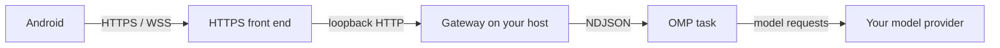

<p align="center"></p>

# PinkCollab

**Your coding agent stays on your machine. You don't have to stay at your desk.**

PinkCollab adds an Android control surface to the [Oh My Pi (OMP)](https://omp.sh/) setup you already use. OMP keeps working on your computer. The phone is how you start a task, follow it, and step in — without replacing OMP, moving the project, or configuring model providers on the phone.

[Get started](docs/getting-started.md) · [Download Android APK](https://github.com/3xian/PinkCollab/releases/latest/download/pinkcollab-android.apk) · [Documentation](docs/README.md)

## Away from the desk

**Start a task in a project that already lives on the host.** You are not at the computer, and the next thing you want is a new OMP task. On Android, open **Workspaces**, pick an allowed directory, tap **Create task here**, and send the first prompt. The Gateway starts `omp --mode rpc-ui` in that directory. You do not attach to a session that is already running in a terminal.

**See the work, and answer only if it actually asks.** Open the app to read the reply and tool activity. While the task is still running, add a constraint from the composer. If OMP raises a choice, confirmation, or other input request, that request appears in the open app and you answer it there. Closing the app does not send a system notification.

**Check more than one host from the same phone.** After you pair a laptop and a server, Android shows the tasks those Gateways created. You still pair and revoke each host yourself. This is not a shared team account, and it is not a cloud relay.

## Why it works this way

**Keep the tools you already chose.** PinkCollab does not install a second agent and does not ask you to move the repository. The Gateway starts OMP with the provider configuration already on the host, so you do not put provider credentials on the phone. A background service does not inherit your terminal's environment, which is why setup records an absolute `omp` path. Do not assume every plugin, shell setting, or variable arrives unchanged.

**Delegate the turn, and take it back.** While the OMP process is still attached, you can watch it, add instructions, answer a real input request, interrupt the current turn, or stop the process. **Interrupt** aborts the current turn and keeps the runtime, so you can prompt again. **Stop** ends the process; that task then accepts no further commands. Nothing here promises the agent will finish the work unattended.

**The grant and the boundary stay visible.** Pairing uses a five-minute, single-use code. `pinkcollab revoke` removes that phone's access on the host; deleting the host in Android does not. The workspace list limits which directories the Gateway will browse and start tasks in. It is not an OS sandbox, and a prompt that says "do not edit files" is not one either. OMP still sends model requests to the provider configured on the host, and the phone receives task output.

SSH and tmux remain the right tools when you need a shell. PinkCollab is a task surface for OMP, not a claim that remote work was otherwise impossible.

## What sits between the phone and OMP



The Gateway listens on loopback and does not terminate TLS. The phone connects to an HTTPS front end — Tailscale Serve on your tailnet, Tailscale Funnel on the public internet, or your own reverse proxy — which forwards to the Gateway. Pairing does not create that front end. The loopback address is not the address you type into the phone. See [deployment](docs/deployment.md).

## Start here

You need OMP already installed and able to reach its provider, an Android phone (8.0 / API 26 or newer), and an HTTPS address that phone can reach. There is no iOS or browser client.

This installs the Gateway launcher. It is not the full setup:

```sh
npm install -g pinkcollab@latest
```

Node.js 18 or newer is required for that npm install, not for a [standalone binary](docs/getting-started.md#install-without-nodejs). The path from a working OMP install to a first task you can see is in [Get started](docs/getting-started.md).

The Gateway and Android app in this checkout match the v0.1.1 release. A later release can diverge. When you mix an APK and a Gateway from different releases, confirm both still speak protocol version 1.

<a id="current-limits"></a>
## Before you install

- **Android only, and only tasks this Gateway creates.** A session you started by hand in a terminal cannot be attached.
- **The app is not a notification system.** A waiting question is visible while the app is open and connected.
- **Disconnect, restart, sleep, and shutdown are different.** The phone reconnecting does not mean a shut-down host kept the process alive. A Gateway restart does not restore running OMP processes; those tasks show as offline. Readable history is not a running process, and it is not a replay of every live event.
- **Completed does not mean the process has exited.** A finished turn can still have an attached runtime, and that live process still counts against `max_sessions`. See [usage](docs/usage.md#after-a-disconnect-or-restart).
- PinkCollab is not a terminal, editor, Git client, or multi-user product.

## Where to go next

- [Get started](docs/getting-started.md) — one path to the first task
- [Daily use](docs/usage.md) — steer, answer, interrupt, stop, several hosts
- [Deployment and security](docs/deployment.md) — HTTPS, pairing, revocation, a background service
- [CLI and configuration](docs/reference.md) — commands, defaults, validation
- [Architecture](docs/architecture.md) — what is stored, and what a restart can restore
- [Development](docs/development.md) — build and test from source
- [Protocol](docs/protocol.md) — for client and adapter authors
- [Release process](docs/npm-release.md) — for maintainers, not for installation

<a id="quick-start"></a>
<a id="how-a-task-runs"></a>
<a id="commands"></a>
<a id="configuration"></a>
<a id="build-android"></a>
<a id="build-the-gateway-from-source"></a>
<a id="what-survives-a-restart"></a>
<a id="validation"></a>
<a id="project-layout"></a>

Older README section links land here. Their contents now live in the [documentation index](docs/README.md).

License: MIT.
