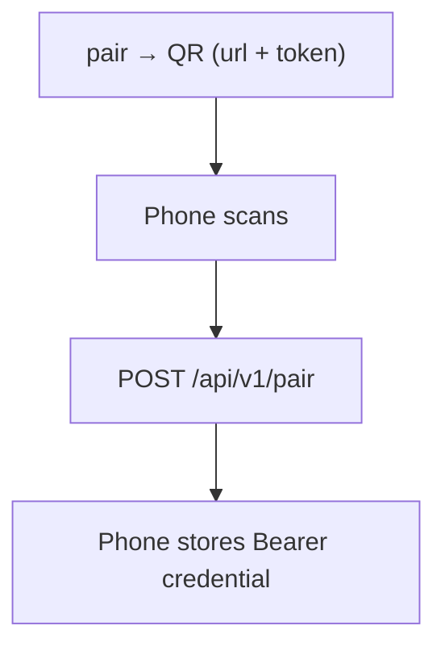

<p align="center">
  
</p>

# PinkCollab - Oh My Pi (OMP) Android Controller

[](#build-android)
[](android/app/build.gradle.kts)
[](android/)
[](android/app/src/main/java/dev/pinkcollab/ui/)

[Website](https://3xian.github.io/PinkCollab/) · [Setup guide](#quick-start) · [API documentation](docs/protocol.md)

A remote control plane for **Oh My Pi (OMP)**: start and follow agent tasks on your computers from an Android phone.

- Browse an allowed project directory and create a task in it.
- Watch streaming replies, tool activity, and questions the agent asks.
- Send **Prompt / Steer**, answer those questions, **Interrupt**, or **Stop**.
- See tasks from every paired host in one list, newest first, each with its live status.

Gateway: **Rust / Tokio / Axum / SQLite**, shipped as one standalone executable.
Android: **Kotlin / Jetpack Compose / Material 3**.
Model provider credentials stay on the host — the phone talks to your Gateway, never to a model provider.

<p align="center">
  
  <br />
  <em>Same code. Brighter tomorrow. Keep your agents close, and enjoy life beyond the desk.</em>
</p>

## How a task runs


- **Android** sends REST requests and keeps one WebSocket open for live updates.
- **Gateway** authenticates the caller, enforces the workspace allowlist, and owns the task lifecycle.
- **OMP** runs as one subprocess per task (`omp --mode rpc-ui`); the Gateway speaks NDJSON to it over stdin/stdout.

*Why one subprocess per task: a crashed task cannot take down the others.*

## Quick start

Prerequisites: **Rust 1.89+** for the Gateway, **JDK 17+ / Android SDK 36** for Android, and **OMP installed on every host** that will run tasks.

```sh
cd gateway
cargo build --release --locked --bin pinkcollab-gateway
./target/release/pinkcollab-gateway init --workspace /absolute/path/to/projects --workspace /another/root
./target/release/pinkcollab-gateway status
./target/release/pinkcollab-gateway serve
```

On Windows, use `target\release\pinkcollab-gateway.exe` wherever these commands say `./target/release/pinkcollab-gateway`.

The five steps, in order:

1. **Build** — `cargo build` leaves the binary in `gateway/target/release/`.
2. **`init` once** — creates `~/.pinkcollab` and `config.yaml` with every `--workspace` root, and records `omp` as the absolute path it resolved, so a service manager's different `PATH` cannot break it. On Unix both are private to your user (`0700` / `0600`); Windows keeps the directory's default ACL. It only writes the config, never starts the server, and refuses to overwrite an existing one — add more roots by editing `workspaces`.
3. **`status`** — preflights the config, every root, OMP, database, Tailscale state, and listen socket. Run it before `serve`; it exits non-zero if the configured port is already occupied or another prerequisite is broken.
4. **`serve`** — runs the Gateway and holds that terminal busy; [a background service](#run-as-a-background-service) is the alternative.
5. **`pair`** — in a second terminal, mint the code the phone scans: [`setup-funnel --pair`](#tailscale-funnel--public-simplest) brings up a public front end and pairs in one go, `pair --url <front-end root>` uses one you already run. A fresh `init` leaves `public_url` empty, so bare `pair` fails until one of them supplies it. Then scan the code in Android and create your first task.

> Every subcommand reads the same data directory (`--data-dir`, default `~/.pinkcollab`). Pass the same one to `init`, `serve`, `pair`, and the service: a different directory means a different config and a different set of credentials, so the phone would be pairing against nothing.

## Commands

| Command | What it does |
| --- | --- |
| `init --workspace <dir>...` | One-time bootstrap: creates the data dir and `config.yaml` with every `--workspace` root. |
| `serve` | Runs the Gateway. **This is the default when no subcommand is given** — after `init`, running the binary alone is enough. |
| `status` | Preflights config, roots, OMP, database, Tailscale and port state without starting the Gateway. Run it while the Gateway is stopped; exits non-zero while a problem remains. |
| `pair [--url <root>] [--qr <file>]` | Prints single-use pairing JSON on stdout and, in a terminal, a scannable QR code. `--url` defaults only to the configured `public_url`; when neither is present the command fails instead of guessing an endpoint. `--qr` additionally writes a PNG. |
| `clients` | Lists paired devices: `clientId`, name, pairing time. |
| `setup-funnel [--https 443] [--dry-run] [--tailscale <path>] [--pair]` | Publishes the loopback Gateway on the internet with Tailscale Funnel, writes `public_url`, and with `--pair` prints a pairing code straight away. |
| `revoke --client <clientId>` | Deletes a paired device's credential on the host. Fails when the id is unknown. |
| `service` *(Windows only)* | Runs under the Windows Service Control Manager. |

## Configuration

Lives at `~/.pinkcollab/config.yaml`; see [`gateway/config.example.yaml`](gateway/config.example.yaml).

| Key | Default | What it decides |
| --- | --- | --- |
| `listen` | `127.0.0.1:8787` | The socket to bind — **must be a loopback address**. |
| `public_url` | empty | The root URL the phone dials, baked into the QR code. Must be `https://…` in production. |
| `name` | hostname | The host label shown in Android. |
| `workspaces` | `[]` | Allowed root directories — the Gateway refuses to touch anything outside them. *This is the sandbox for all file access.* |
| `omp` | absolute path `init` resolved | The OMP executable. `init` stores the absolute path it found, which is what a service needs: their `PATH` differs from your terminal's, so a bare `omp` fails there. |
| `omp_args` | `[]` | Extra OMP flags; may not override `--mode` or session storage. |
| `max_sessions` | `8` | Concurrent **live** OMP processes (1–100). A session frees its slot as soon as its process exits — on completion, failure, or **Stop** — so finished tasks do not count against it. |

Startup validation rejects: empty `workspaces`, `max_sessions` outside 1–100, a non-loopback `listen`, a `public_url` that is not a bare root URL, and `omp_args` that override mode or session storage.

## Connect Android

Android requires **HTTPS/WSS**. Plain HTTP is allowed only in debug builds for `localhost`, `127.0.0.1`, and the emulator host `10.0.2.2`.

The Gateway **always listens on loopback and never handles TLS**; something in front of it terminates HTTPS and forwards to `127.0.0.1:8787`. That front end is the only thing you pick:


| Front end | Reachable from | Phone needs |
| --- | --- | --- |
| **Tailscale Funnel** | The public internet | Nothing at all |
| **Tailscale Serve** | Your tailnet only | Tailscale, same tailnet |
| **Your own reverse proxy** | Whatever you expose | Whatever that proxy requires |

Only two Gateway keys matter here — `listen` (loopback) and `public_url` (what the phone dials).

### Tailscale Funnel — public, simplest

Tailscale terminates TLS and forwards to the loopback Gateway, so **no certificate is needed anywhere**:

```yaml
listen: 127.0.0.1:8787
public_url: https://my-host.example-tailnet.ts.net
```

```sh
pinkcollab-gateway setup-funnel --pair     # publishes the port, writes public_url, prints a code
# equivalent, minus the pairing code:
#   tailscale funnel --bg --https=443 --yes http://127.0.0.1:8787
tailscale funnel status
```

`setup-funnel` flags: `--dry-run` prints the plan without changing anything, `--https 8443` picks a non-default public port, `--tailscale <path>` points at the CLI when it is not on `PATH`.

Caveats:

- The tailnet policy must grant this node the `funnel` attribute. *Otherwise the CLI stops with `Funnel not available; "funnel" node attribute not set`.*
- Funnel serves HTTPS on **443, 8443 or 10000** only; a non-default port belongs in `public_url`, e.g. `https://…ts.net:8443`.
- Funnel and Tailscale Serve share one configuration — publishing replaces a Serve mapping on the same port. `tailscale funnel --https=443 off` removes it.
- **The endpoint is public.** Reachability is not security: tokens stay single-use and short-lived, credentials stay revocable, the workspace allowlist still applies, and every REST call and WebSocket upgrade still requires authorization. Never rely on the `.ts.net` hostname staying secret.

### Tailscale Serve — private

Both devices run Tailscale in the same tailnet, and **nothing is exposed to the internet**. Tailscale terminates TLS exactly as with Funnel, but only serves your tailnet:

```sh
tailscale serve --bg http://127.0.0.1:8787
```

```yaml
listen: 127.0.0.1:8787
public_url: https://<hostname>.ts.net
```

### Your own reverse proxy

Caddy, nginx, or any HTTPS tunnel: it owns the certificate and the public or LAN address, and forwards to the loopback Gateway.

```yaml
listen: 127.0.0.1:8787
public_url: https://dev-server.example.com
```

- The proxy must forward **WebSocket Upgrade** and the **`Authorization`** header, with `127.0.0.1:8787` as upstream. *(why: live updates ride on the WebSocket, and it authenticates separately from REST.)*
- For LAN-only use, let the proxy bind the LAN address and reserve it in your router — if it changes, pairing breaks.
- Android must trust the proxy's certificate chain. *(why: Android rejects self-signed chains by default.)*

## Pairing and security



- The QR carries only the Gateway root URL and a one-time token.
- `pair` uses an explicit `--url` or the configured `public_url`. If neither exists it stops with instructions instead of guessing from Tailscale node identity or producing an unreachable loopback URL. Pairing JSON stays on stdout for scripts; the QR is shown only when stderr is a terminal, and `--qr <file>` also writes a PNG.
- `/api/v1/pair` is the **only** endpoint reachable without a credential. *(why: the phone has nothing to authenticate with yet, so trust has to start somewhere.)*
- Everything else — including the WebSocket — returns `401` without a valid `Bearer` credential.

| Token rule | Value |
| --- | --- |
| Lifetime | 5 minutes |
| Successful uses | 1 — consumed on success |

*Why so tight: the 192-bit random code is the only thing between the internet and your host until pairing succeeds, so it is short-lived and consumed transactionally on first use.*

```sh
pinkcollab-gateway pair                        # code for the configured public_url
pinkcollab-gateway pair --qr pairing.png       # ... and a PNG for another screen
pinkcollab-gateway clients                     # clientId, name, pairing time
pinkcollab-gateway revoke --client client_xxx  # fails when the id does not exist
```

Removing a pairing in Android only clears the phone's local copy — use `revoke` to actually cut host-side access.

## Run as a background service

All three run as the same regular OS user that owns `~/.pinkcollab` and the workspaces. `init` already
wrote an absolute `omp` path, which is what these need: only edit it if OMP moved.

### Windows

```powershell
sc.exe create PinkCollab binPath= '"C:\PinkCollab\pinkcollab-gateway.exe" --data-dir "C:\Users\YOUR_USER\.pinkcollab" service' start= auto
```

Then open **Services → PinkCollab → Properties → Log On**, switch the account from LocalSystem to that user, grant *Log on as a service*, and start it. *(why: the Gateway and OMP need that user's credentials and file permissions; LocalSystem has neither.)*

```powershell
sc.exe start PinkCollab
sc.exe stop PinkCollab
```

### Linux (systemd)

Copy `deploy/pinkcollab.service` to `~/.config/systemd/user/`:

```sh
systemctl --user daemon-reload
systemctl --user enable --now pinkcollab
journalctl --user -u pinkcollab -f
```

Add `loginctl enable-linger YOUR_USER` to keep it running after logout.

### macOS (launchd)

Replace `YOUR_USER` in `deploy/dev.pinkcollab.gateway.plist` and copy it to `~/Library/LaunchAgents/`:

```sh
launchctl bootstrap gui/$(id -u) ~/Library/LaunchAgents/dev.pinkcollab.gateway.plist
launchctl kickstart -k gui/$(id -u)/dev.pinkcollab.gateway
```

### Updates

Stop the service, replace the binary, start it again. Identity and credentials survive — they live in SQLite (WAL), not in the binary. A graceful shutdown also stops the OMP runtimes the Gateway started.

Configs written before embedded TLS was removed must drop `tls_cert` and `tls_key` entirely — the Gateway rejects any config that still sets them — and move TLS termination to Funnel, Serve, or a reverse proxy.

## Build Android

```sh
cd android
./gradlew :app:assembleDebug     # Windows: gradlew.bat
```

Set `sdk.dir` in `local.properties`, or set `ANDROID_HOME`. The APK is written to `android/app/build/outputs/apk/debug/app-debug.apk`.

Install on a connected device:

```sh
adb install -r android/app/build/outputs/apk/debug/app-debug.apk
```

To start a task: **Workspaces → choose a directory → create a task → enter a prompt → start**. The directory browser shows each project's Git branch and working-tree status when `git` is available.

Actions on a task:

- **Prompt / Steer** — the button label and the `streamingBehavior` sent to OMP both key off `status == "running"`: a running session is steered, anything else (idle, completed, failed) starts a new turn.
- **Interrupt** sends OMP `abort` and keeps the runtime attached, so you can keep prompting.
- **Stop** closes OMP's stdin and terminates the process; the session then takes no further commands.
- **Switch model** cycles the model scope configured on that host, and appears only while a runtime is attached and OMP reports a model.
- **Delete** is not exposed in the app: `DELETE /api/v1/sessions/:id` drops Gateway-side management metadata once the session is stopped, and never touches OMP's own session files.

On some Windows/JDK setups Gradle fails with `Unable to establish loopback connection` — create `C:/tmp` and set `JAVA_TOOL_OPTIONS=-Djdk.net.unixdomain.tmpdir=C:/tmp`.

## What survives a restart

| Data | Survives | Note |
| --- | --- | --- |
| Host identity, credentials, session metadata | Yes | SQLite (WAL) in the data dir |
| Running OMP processes | No | Their metadata is kept and they show as **offline** |
| Conversation history | Yes | Read on demand from OMP's JSONL session files |

*Why the split: live activity is buffered in memory for speed, while transcripts stay in OMP's own files so nothing is duplicated.*

## Validation

```sh
cd gateway
cargo fmt --check
cargo clippy --all-targets --all-features --locked -- -D warnings
cargo test --all-features --locked
cargo test --test omp_smoke -- --ignored   # #[ignore]d: needs OMP installed, or OMP_EXECUTABLE set

cd ../android
./gradlew :app:assembleDebug :app:testDebugUnitTest :app:lintDebug
```

`omp-fixture`, the deterministic stand-in for a real OMP, builds only with the `test-fixtures` feature.

## Project layout

```text
gateway/src/   api · config · events · funnel · model · omp · session · storage · workspace · windows
android/app/src/main/java/dev/pinkcollab/   data · ui · ui/theme
deploy/        systemd and launchd templates
docs/          API protocol (protocol.md)
```

## Current limits

- No terminal emulator, Git client, code editor, or Cloud Relay.
- No multi-user permissions — one host identity with paired devices.
- Sessions are managed, not adopted: one started by hand in a terminal cannot be attached, and an exited process is not restored on restart (it shows as **offline**).
- Live tool events are buffered in memory; after a restart, history is restored from OMP files without the full tool transcript.
- Android background notifications are planned; a task waiting on your input only shows it while the app is open.
