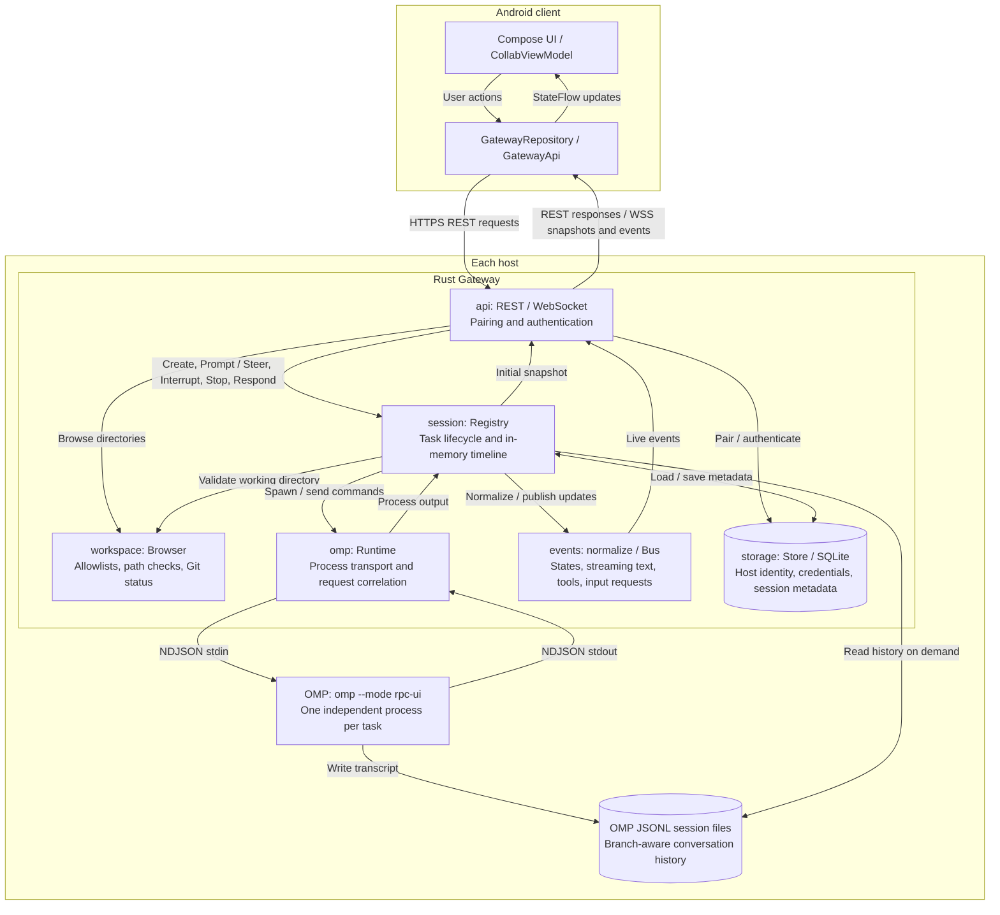

<p align="center">
  
</p>

# PinkCollab

[](#connect-android)
[](android/app/build.gradle.kts)
[](android/)
[](android/app/src/main/java/dev/pinkcollab/ui/)

[Website](https://3xian.github.io/PinkCollab/) · [Setup guide](#quick-start) · [API documentation](docs/protocol.md)

A remote control plane for **Oh My Pi (OMP)**. Manage agent tasks across computers and servers from Android: choose a project directory, create an OMP session, follow streaming replies and tool execution, and send Prompt / Steer, Interrupt, Stop, or interactive responses.

The Gateway uses **Rust / Tokio / Axum / SQLite**. The Android client uses **Kotlin / Jetpack Compose / Material 3**. The Gateway ships as a standalone executable; each host still needs OMP and its runtime dependencies. Model provider credentials remain on the host.

<p align="center">
  
  <br />
  <em>Same code. Brighter tomorrow. Keep your agents close, and enjoy life beyond the desk.</em>
</p>

## Module flow



Each paired host runs its own Gateway and OMP processes; Android aggregates their task states. SQLite stores management metadata only — live activity is buffered in memory, while transcripts stay in OMP's JSONL files and are read on demand. `config` supplies startup settings and `model` defines the shared protocol types.

## Implemented MVP

- Persistent host identity, single-use QR pairing, client authentication, and credential revocation.
- Workspace allowlists, directory browsing, symlink boundary checks, and Git branch/status information.
- An independent `omp --mode rpc-ui` process for each task, with startup handshakes and correlated requests.
- Session registry, normalized states, REST endpoints, and WebSocket snapshots and live events.
- Tasks grouped into Needs Attention, Running, and Recent across multiple hosts.
- Task creation in a selected directory, streaming replies, expandable tool details, Prompt / Steer, and Interrupt / Stop.
- OMP select, confirm, input, and editor requests and responses.
- SQLite management metadata; transcripts read per branch from OMP's JSONL session files.
- A Windows Service entry point, Linux systemd user-service template, and macOS launchd template.
- Density-specific Android launcher icons using the original white-background logo with rounded corners, centered on the C.

## Quick start

Build prerequisites: **Rust 1.89+** for the Gateway, and **JDK 17+ / Android SDK 36** for Android. Install and configure OMP on every host where tasks will run.

The whole setup is five steps:

1. Build the Gateway binary.
2. `init` once — it creates `~/.pinkcollab/config.yaml` seeded with your first `--workspace`.
3. Edit the configuration if you need more roots, an absolute `omp` path, or HTTPS.
4. Run it, either in the foreground or as a background service.
5. `pair` and scan the QR code from Android, then create your first task.

```sh
cd gateway
cargo build --release --locked --bin pinkcollab-gateway
./target/release/pinkcollab-gateway init --workspace /absolute/path/to/projects
./target/release/pinkcollab-gateway serve
```

On Windows, run `target\release\pinkcollab-gateway.exe` instead of the `./target/release/...` paths shown above.

### What these commands mean

`init` is a one-time bootstrap: it creates `~/.pinkcollab` (mode `0700`) and writes `config.yaml` (mode `0600`) with your `--workspace` as its single allowed root. It never starts the server, and refuses to overwrite an existing `config.yaml` — add more roots by editing the `workspaces` list.

`serve` runs against that configuration, and **is the default when no subcommand is given**: after the first `init`, running `pinkcollab-gateway` alone is enough.

Use the same `--data-dir` everywhere (`init`, `serve`, `pair`, and the service); a different directory means a different configuration and set of credentials. Defaults: configuration at `~/.pinkcollab/config.yaml`, listener `127.0.0.1:8787`. Background services also need an absolute `omp` path — the service's `PATH` differs from your terminal's, so a bare `omp` fails there.

### Run as a background service (Windows)

The Windows binary includes a native Service Control Manager entry point, `service`. Initialize the configuration first as the regular user that will run the service, then register it as an administrator. Place the executable somewhere permanent, such as `C:\PinkCollab\pinkcollab-gateway.exe`.

```powershell
sc.exe create PinkCollab binPath= '"C:\PinkCollab\pinkcollab-gateway.exe" --data-dir "C:\Users\YOUR_USER\.pinkcollab" service' start= auto
```

Then open **Services → PinkCollab → Properties → Log On**, switch the account from LocalSystem to that regular user, grant it the *Log on as a service* right, and start the service. Restrict access to the user profile, OMP configuration, and workspaces to that account.

```powershell
sc.exe start PinkCollab
sc.exe stop PinkCollab
```

For development, running `pinkcollab-gateway.exe serve` in a terminal is enough — Ctrl+C stops it and no registration is needed. To update, stop the service, replace the binary, and start it again; identity and pairing credentials survive. Linux (systemd) and macOS (launchd) templates live in [`deploy/`](deploy/).

### Connect Android

Android requires **HTTPS/WSS**. Plain HTTP is accepted only for loopback and the Android emulator. Three settings decide how the phone reaches the Gateway:

| Setting | What it does |
| --- | --- |
| `listen` | The socket to bind. Keep the default `127.0.0.1:8787` and put an HTTPS reverse proxy in front of it (forward WebSocket Upgrade and `Authorization`), or bind a LAN/VPN address — but then `tls_cert` and `tls_key` become mandatory, because the Gateway rejects non-loopback listeners without TLS. |
| `tls_cert` / `tls_key` | The PEM certificate and key, used when the Gateway terminates TLS itself. Android must trust the chain. |
| `public_url` | The root URL the phone dials, and what `pair` bakes into the QR code. It must be HTTPS, and its hostname must match the certificate. |

If the host has **no public IP or domain**, choose one of these:

- **Tailscale (recommended).** Install it on the host and the phone, join both to the same tailnet, and issue a certificate Android already trusts using `tailscale cert <hostname>`. Then look up the host's tailnet address with `tailscale ip -4` and bind it directly:

  ```yaml
  listen: 100.x.y.z:8787
  public_url: https://<hostname>.ts.net
  tls_cert: /absolute/path/cert.pem
  tls_key: /absolute/path/key.pem
  ```

- **LAN with a self-signed certificate.** Works only while the phone shares the host's Wi-Fi, and the certificate must be installed on the phone as a trusted CA:

  ```yaml
  listen: 192.168.1.20:8787
  public_url: https://192.168.1.20:8787
  tls_cert: /absolute/path/cert.pem
  tls_key: /absolute/path/key.pem
  ```

  Generate the pair with `openssl req -x509 -newkey rsa:2048 -nodes -days 365 -keyout key.pem -out cert.pem -subj "/CN=192.168.1.20" -addext "subjectAltName=IP:192.168.1.20"`. Reserve the address in your router — otherwise it changes and pairing breaks.

```sh
pinkcollab-gateway pair --url https://dev-server.example.com --qr pairing.png
```

In Android, open the host connection screen and scan the QR code, or enter the printed root URL and token. Tokens expire after five minutes and can be consumed once — share them only with the intended device.

Build the Android app:

```sh
cd android
# Set sdk.dir in local.properties, or set ANDROID_HOME.
./gradlew :app:assembleDebug
```

On Windows, use `gradlew.bat`. The APK is written to `android/app/build/outputs/apk/debug/app-debug.apk`. Debug builds support `http://10.0.2.2:8787` for connecting an emulator to its host computer. Release builds require HTTPS.

To start a task, open **Workspaces → choose a directory → create a task here → enter a prompt → start**. Sending a message while the agent is running uses Steer; an idle or completed session accepts another Prompt. Interrupt keeps the runtime available. Stop closes it.

Revoke a lost device's credential using the `clientId` returned by the pairing API:

```sh
pinkcollab-gateway revoke --client client_xxx
```

Removing a pairing in Android only clears the device's local credential — use the command above to revoke host-side access.

## Configuration and persistence

See [the example configuration](gateway/config.example.yaml). `max_sessions` limits concurrent OMP runtimes, including completed sessions whose runtimes remain available for follow-up prompts. Stop a session to release its slot.

Restarting the Gateway does not automatically restore exited OMP processes. Session metadata is retained, and previously active tasks become offline. Historical conversations are still read from OMP's session files. You can create a new task in the same working directory.

## Validation

```sh
cd gateway
cargo fmt --check
cargo clippy --all-targets --all-features --locked -- -D warnings
cargo test --all-features --locked
# Handshake smoke test against installed OMP; does not send a model prompt.
cargo test --test omp_smoke -- --ignored

cd ../android
./gradlew :app:assembleDebug :app:testDebugUnitTest :app:lintDebug
```

Tests exercise real HTTP/WebSocket connections and subprocess NDJSON communication. The deterministic `omp-fixture` is built only with the `test-fixtures` feature. Production builds select the `pinkcollab-gateway` binary.

On some Windows/JDK installations, a long Unix domain socket temporary path can cause Gradle to fail with `Unable to establish loopback connection`. Create a short temporary directory such as `C:/tmp`, then set `JAVA_TOOL_OPTIONS=-Djdk.net.unixdomain.tmpdir=C:/tmp` in the current terminal.

## Project layout and deployment

```text
gateway/src/  api / config / events / model / omp / session / storage / workspace
android/app/src/main/java/dev/pinkcollab/  data / ui
android/app/src/main/res/                 launcher icon resources
docs/assets/                             shared rounded logo
deploy/                                  systemd and launchd templates
docs/                                    API protocol and deployment guides
```

See [the API protocol](docs/protocol.md) and [the deployment guide](docs/deployment.md) for details.

## Current limits

The MVP does not include a terminal emulator, full Git client, Cloud Relay, multi-user permissions, code editor, or takeover of manually started OMP TUI sessions. Android system-level background notifications are planned for a later phase; Needs Attention currently updates while the app is open. Live tool events and activity are buffered in memory. After a restart, historical user and assistant messages are restored from OMP files without copying the full tool transcript.
