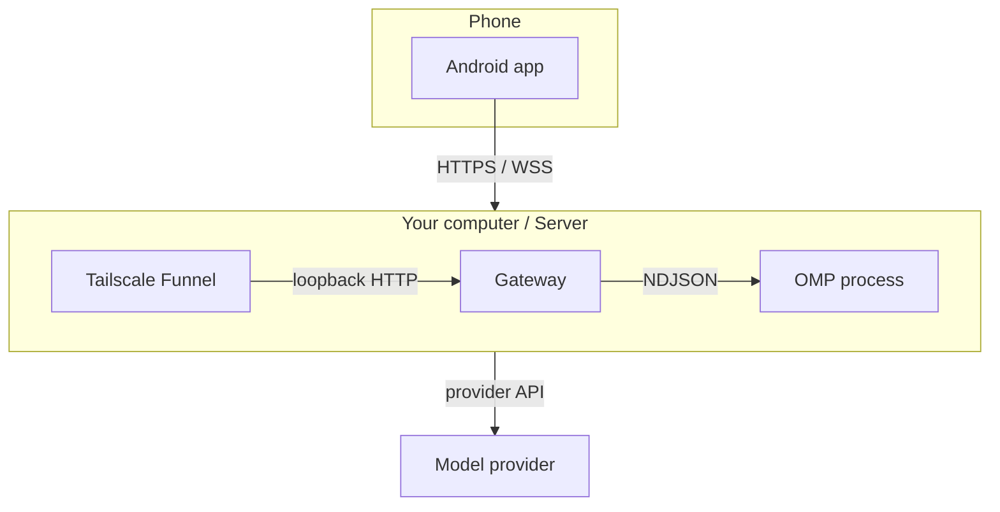

<p align="center"></p>

<h1 align="center">PinkCollab</h1>

<p align="center"><strong>Spawn and steer OMP sessions from Android.</strong></p>

[Oh My Pi (OMP)](https://omp.sh/) runs on a host you own. Your phone launches the work, follows it live, and answers when OMP needs you.



## Install

1. **Host:** Node.js 18+. Install Tailscale and allow Funnel for this node.
2. **Phone:** install the [release APK](https://github.com/3xian/PinkCollab/releases/latest/download/pinkcollab-android.apk).

```sh
npm install -g pinkcollab@latest
```

## Use

On the host, allow directories that already exist. On Windows, a path looks like `C:\code`. Repeat `--workspace` for each root you want to expose:

```sh
pinkcollab init --workspace /absolute/path/to/projects --workspace /another/root
pinkcollab funnel
pinkcollab serve
```

A later `init` fails once `config.yaml` exists. Add or remove roots by editing `workspaces` in `config.yaml` instead.

Leave that terminal open. In another terminal:

```sh
pinkcollab pair
```

Scan the QR in the app. Open **Workspaces**, choose one of the directories you allowed, create a session, and send a prompt.

The pairing code lasts five minutes and works once. If it expires, run `pair` again.

If Funnel is not allowed for this node, `funnel` stops. Enable the `funnel` attribute in the Tailscale admin console, then run it again.

## Docs

- [CLI and configuration](docs/reference.md)
- [Daily use](docs/usage.md)
- [Architecture](docs/architecture.md)
- [Protocol v1](docs/protocol.md)
- [Deployment and networking](docs/deployment.md)
- [Development](docs/development.md)
- [Releases](docs/npm-release.md)

## License

[MIT](LICENSE)
