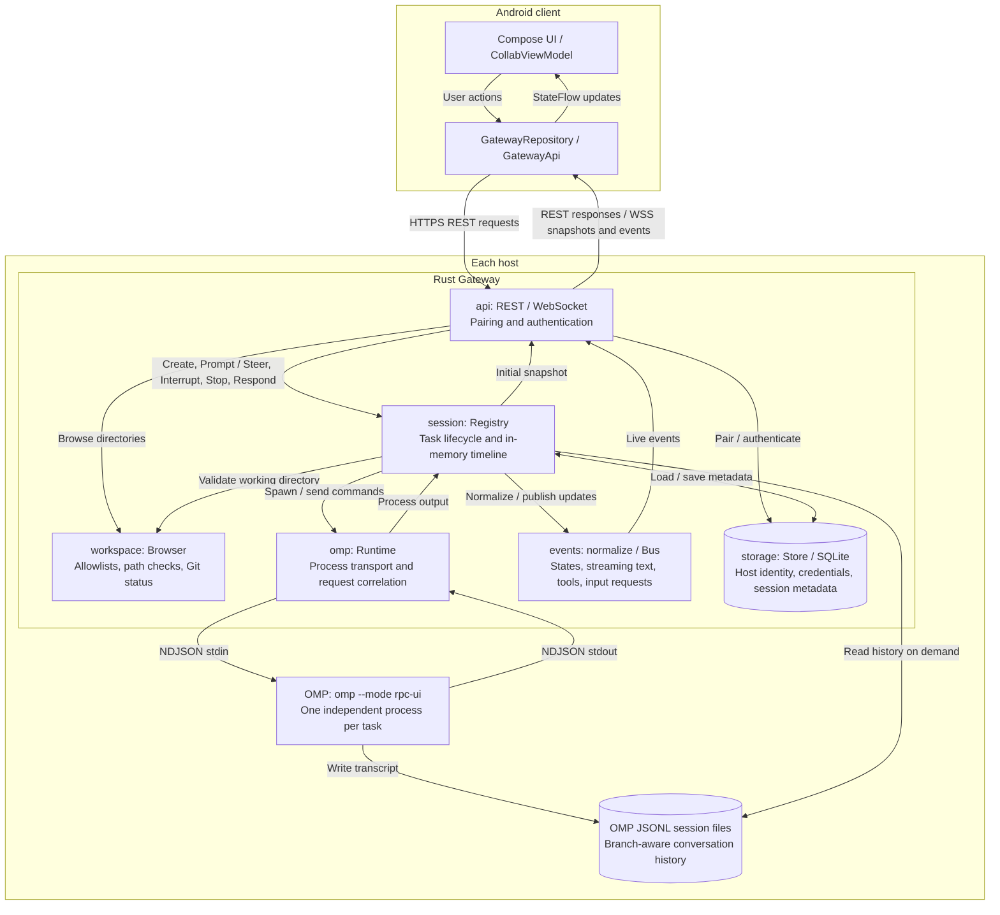

<p align="center">
  
</p>

# PinkCollab

[Website](https://3xian.github.io/PinkCollab/) · [Setup guide](#quick-start) · [API documentation](docs/protocol.md)

A remote control plane for **Oh My Pi (OMP)**. Manage agent tasks across computers and servers from Android: choose a project directory, create an OMP session, follow streaming replies and tool execution, and send Prompt / Steer, Interrupt, Stop, or interactive responses.

The Gateway uses **Rust / Tokio / Axum / SQLite**. The Android client uses **Kotlin / Jetpack Compose / Material 3**. The Gateway ships as a standalone executable; each host still needs OMP and its runtime dependencies. Model provider credentials remain on the host.

<p align="center">
  
  <br />
  <em>Same code. Brighter tomorrow. Keep your agents close, and enjoy life beyond the desk.</em>
</p>

## Module flow



Commands travel from Android through the API and session registry to OMP; process output is normalized into session updates and streamed back over WebSocket. Each paired host runs its own Gateway and OMP processes, while Android aggregates their task states. Model provider credentials stay on the host.

SQLite stores management metadata, not conversation transcripts. Live activity is buffered in memory; historical messages are read on demand from OMP's JSONL files. `config` supplies startup settings and `model` defines the shared protocol types.

## Implemented MVP

- Persistent host identity, single-use QR pairing, client authentication, and credential revocation.
- Workspace allowlists, directory browsing, symlink boundary checks, and Git branch/status information.
- An independent `omp --mode rpc-ui` process for each task, with startup handshakes and correlated requests.
- Session registry, normalized states, REST endpoints, and WebSocket snapshots and live events.
- Tasks grouped into Needs Attention, Running, and Recent across multiple hosts.
- Task creation in a selected directory, streaming replies, expandable tool details, Prompt / Steer, and Interrupt / Stop.
- OMP select, confirm, input, and editor requests and responses.
- SQLite management metadata; historical messages read on demand from the current branch of OMP's own JSONL session files.
- A Windows Service entry point, Linux systemd user-service template, and macOS launchd template.
- Density-specific Android launcher icons using the original white-background logo with rounded corners, centered on the C.

## Quick start

Build prerequisites: **Rust 1.89+** for the Gateway, and **JDK 17+ / Android SDK 36** for Android. Install and configure OMP on every host where tasks will run.

```sh
cd gateway
cargo build --release --locked --bin pinkcollab-gateway
./target/release/pinkcollab-gateway init --workspace /absolute/path/to/projects
./target/release/pinkcollab-gateway serve
```

On Windows, use `target\release\pinkcollab-gateway.exe`. The default configuration is `~/.pinkcollab/config.yaml`, and the Gateway listens on `127.0.0.1:8787`. Edit `workspaces` to add allowed roots. For background services, set `omp` to the executable's absolute path.

### Connect Android

Expose the Gateway over **HTTPS/WSS**. Configure `tls_cert` / `tls_key` and listen on a reachable network address, or place an HTTPS reverse proxy in front of the default loopback endpoint. Android must trust the certificate, and its hostname must match the Gateway URL. Tailscale is an optional networking choice; the protocol does not depend on it.

```sh
pinkcollab-gateway pair --url https://dev-server.example.com --qr pairing.png
```

In Android, open the host connection screen, scan the QR code, and complete pairing. Alternatively, enter the root URL and single-use token printed by the command. Pairing tokens expire after five minutes and can be consumed once. Run the pairing command with the same `--data-dir` as the service, and share the QR code or token only with the intended device.

Build the Android app:

```sh
cd android
# Set sdk.dir in local.properties, or set ANDROID_HOME.
./gradlew :app:assembleDebug
```

On Windows, use `gradlew.bat`. The APK is written to `android/app/build/outputs/apk/debug/app-debug.apk`. Debug builds support `http://10.0.2.2:8787` for connecting an emulator to its host computer. Release builds require HTTPS.

To start a task, open **Workspaces → choose a directory → create a task here → enter a prompt → start**. Sending a message while the agent is running uses Steer; an idle or completed session accepts another Prompt. Interrupt keeps the runtime available. Stop closes it.

Revoke a lost device's credential using the `clientId` returned by the pairing API:

```sh
pinkcollab-gateway revoke --client client_xxx
```

Removing a local pairing in Android clears the device's stored credential. Use the command above to revoke access on the host.

## Configuration and persistence

See [the example configuration](gateway/config.example.yaml). `max_sessions` limits concurrent OMP runtimes, including completed sessions whose runtimes remain available for follow-up prompts. Stop a session to release its slot.

Restarting the Gateway does not automatically restore exited OMP processes. Session metadata is retained, and previously active tasks become offline. Historical conversations are still read from OMP's session files. You can create a new task in the same working directory.

## Validation

```sh
cd gateway
cargo fmt --check
cargo clippy --all-targets --all-features --locked -- -D warnings
cargo test --all-features --locked
# Handshake smoke test against installed OMP; does not send a model prompt.
cargo test --test omp_smoke -- --ignored

cd ../android
./gradlew :app:assembleDebug :app:testDebugUnitTest :app:lintDebug
```

Tests exercise real HTTP/WebSocket connections and subprocess NDJSON communication. The deterministic `omp-fixture` is built only with the `test-fixtures` feature. Production builds select the `pinkcollab-gateway` binary.

On some Windows/JDK installations, a long Unix domain socket temporary path can cause Gradle to fail with `Unable to establish loopback connection`. Create a short temporary directory such as `C:/tmp`, then set `JAVA_TOOL_OPTIONS=-Djdk.net.unixdomain.tmpdir=C:/tmp` in the current terminal.

## Project layout and deployment

```text
gateway/src/  api / config / events / model / omp / session / storage / workspace
android/app/src/main/java/dev/pinkcollab/  data / ui
android/app/src/main/res/                 launcher icon resources
docs/assets/                             shared rounded logo
deploy/                                  systemd and launchd templates
docs/                                    API protocol and deployment guides
```

See [the API protocol](docs/protocol.md) and [the deployment guide](docs/deployment.md) for details.

## Current limits

The MVP does not include a terminal emulator, full Git client, Cloud Relay, multi-user permissions, code editor, or takeover of manually started OMP TUI sessions. Android system-level background notifications are planned for a later phase; Needs Attention currently updates while the app is open. Live tool events and activity are buffered in memory. After a restart, historical user and assistant messages are restored from OMP files without copying the full tool transcript.
