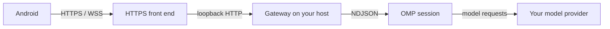

<p align="center"></p>

# PinkCollab

**Spawn and steer OMP sessions from Android.**

The phone follows the session and steps in. [Oh My Pi (OMP)](https://omp.sh/), the project, and the provider credentials stay on your host.

[Get started](docs/getting-started.md) · [Download Android APK](https://github.com/3xian/PinkCollab/releases/latest/download/pinkcollab-android.apk) · [Documentation](docs/README.md)

## Between the phone and OMP



The Gateway listens on loopback and does not terminate TLS. The phone uses an HTTPS front end — Tailscale Serve, Tailscale Funnel, or your own reverse proxy. Pairing does not create that front end. See [deployment](docs/deployment.md).

## Install

OMP must already reach its provider. You also need Android 8.0 / API 26 or newer, and an HTTPS address that phone can reach. There is no iOS or browser client.

```sh
npm install -g pinkcollab@latest
```

That installs the launcher. Node.js 18 or newer is required for the npm install, not for a [standalone binary](docs/getting-started.md#install-without-nodejs). The path to a first session is [Get started](docs/getting-started.md).

This checkout matches release v0.1.1. An APK and a Gateway from different releases must both speak protocol version 1.

<a id="current-limits"></a>
## Limits

- Android only, and only sessions this Gateway creates. A terminal session cannot be attached.
- No notifications. A waiting question is visible only while the app is open and connected.
- Reconnecting the phone does not revive a shut-down host. A Gateway restart does not restore running OMP processes; those sessions show as offline. Readable history is not a replay of the live stream.
- A finished turn can still hold a live process, and that process counts against `max_sessions`. See [usage](docs/usage.md#after-a-disconnect-or-restart).
- Not a terminal, editor, Git client, cloud relay, or multi-user product.

## Docs

- [Get started](docs/getting-started.md) — first session
- [Daily use](docs/usage.md) — steer, answer, interrupt, stop
- [Deployment and security](docs/deployment.md) — HTTPS, pairing, revocation
- [CLI and configuration](docs/reference.md) — commands and defaults
- [Architecture](docs/architecture.md) — what a restart restores
- [Development](docs/development.md) — build and test
- [Protocol](docs/protocol.md) — client and adapter authors
- [Release process](docs/npm-release.md) — maintainers, not installation

<a id="quick-start"></a>
<a id="how-a-task-runs"></a>
<a id="commands"></a>
<a id="configuration"></a>
<a id="build-android"></a>
<a id="build-the-gateway-from-source"></a>
<a id="what-survives-a-restart"></a>
<a id="validation"></a>
<a id="project-layout"></a>

Older README section links land here. Their contents now live in the [documentation index](docs/README.md).

License: MIT.
