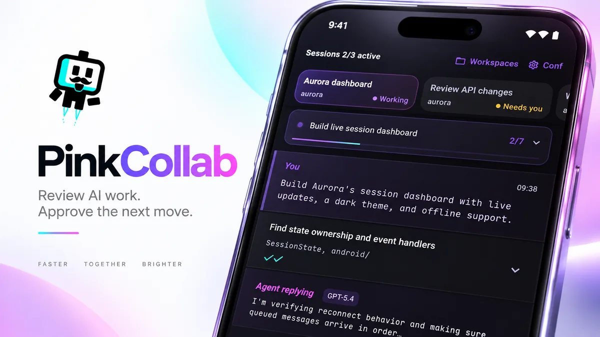

<p align="center"></p>

<h1 align="center">PinkCollab</h1>

<p align="center">
  <a href="https://developer.android.com/"></a>
  <a href="https://kotlinlang.org/"></a>
  <a href="https://developer.android.com/compose"></a>
  <a href="https://www.rust-lang.org/"></a>
  <a href="https://nodejs.org/"></a>
</p>

[PinkCollab](https://3xian.github.io/PinkCollab/) is an **Android client for [Oh My Pi (OMP)](https://omp.sh/)**. Use OMP on your own computer from your phone.

- Read and continue existing conversations without manual imports.
- Start sessions in your projects and switch between them.
- Keep OMP and its model-provider configuration on your computer.

<p align="center"></p>

## Quick start

### 1. Install

On your phone, install the [Android APK](https://github.com/3xian/PinkCollab/releases/latest/download/pinkcollab-android.apk).

On your computer, you need a working [OMP](https://omp.sh/) installation, Node.js 18+, and [Tailscale](https://tailscale.com/download). Use the same OS user that owns your OMP configuration and conversations; `omp --version` must work for that user.

```sh
npm install -g pinkcollab@latest
pinkcollab --version
```

Use the APK and CLI from the **same release**. For version mismatches or existing installations, see [installation and upgrade checks](docs/deployment.md#upgrade-checks-and-duplicate-installations).

### 2. Set up and pair

In your terminal, change to the directory containing your projects, then run:

```sh
pinkcollab setup
```

Setup confirms that directory as a workspace root, guides Tailscale sign-in and Funnel approval, and starts the Gateway as a background service. It does not install OMP or Tailscale. Scan the QR code with the Android app; you can then close the terminal.

**The default connection is public HTTPS via Tailscale Funnel.** Your tailnet must permit Funnel; app access requires pairing credentials, not a secret URL. Your phone does not need Tailscale. For private access, see [Tailscale Serve or your own HTTPS proxy](docs/deployment.md#other-https-front-ends).

Platform setup: [macOS Tailscale installation](docs/deployment.md#recommended-tailscale-installation-on-macos) · [Windows service requirements](docs/deployment.md#run-as-a-background-service) (use an Administrator terminal as your OMP user).

### 3. Send a prompt

- **Continue a conversation:** open a **History** entry in **Tasks**. Its project must be inside your configured workspace roots.
- **Start a new session:** open **Workspaces**, choose a directory, and create a session.

**Close the corresponding OMP instance on your computer before continuing a conversation from the phone.** This is not a takeover of a running terminal session; do not use the same conversation elsewhere while PinkCollab owns its runtime.

Send a prompt and check that OMP responds. Swipe to switch sessions; use **Stop** to interrupt a turn and **Exit** to end its runtime.

If connection or prompts fail, run `pinkcollab doctor` and see [setup troubleshooting](docs/deployment.md#troubleshooting-setup). For missing conversations, see [history discovery](docs/deployment.md#discovering-host-omp-conversations).

## Everyday use

| Task | Command |
| --- | --- |
| Check the host | `pinkcollab` |
| Diagnose problems | `pinkcollab doctor` |
| Pair another phone | `pinkcollab pair` |
| Add project roots | `pinkcollab setup --workspace /path/to/code --workspace /path/to/work` |

To upgrade, install the APK and CLI from the same release, then rerun `pinkcollab setup` to update the background Gateway. Existing settings, conversations, and pairings are preserved. **An update may stop active OMP runtimes**; finish current work first. See [upgrade checks](docs/deployment.md#upgrade-checks-and-duplicate-installations).

## Keep in mind

- Your computer must stay awake and reachable. See the [macOS lid-close FAQ](docs/faq-macos-lid-close.md) and [background-service behavior](docs/deployment.md#run-as-a-background-service).
- OMP runs with the Gateway user's filesystem permissions. Workspace roots are **not an OS sandbox**.
- Removing a host in the app does not revoke access. Use `pinkcollab clients`, then `pinkcollab revoke --client <clientId>` on the host.

## Documentation

- [Deployment and troubleshooting](docs/deployment.md): networking, pairing, services, upgrades, and CLI/configuration
- [Session interface](docs/session-presentation.md): status display and interaction behavior
- [Architecture](docs/architecture.md) · [Protocol 3](docs/protocol.md)
- [Development](docs/development.md) · [Release publishing](docs/npm-release.md)

## License

[MIT](LICENSE)
