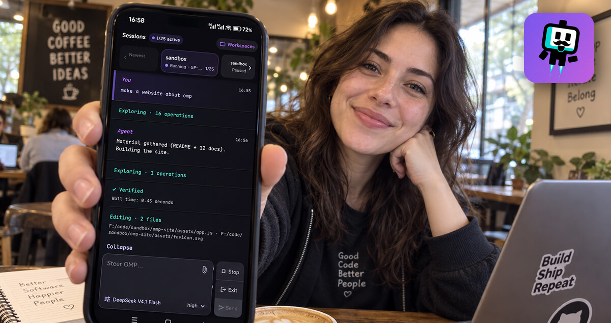
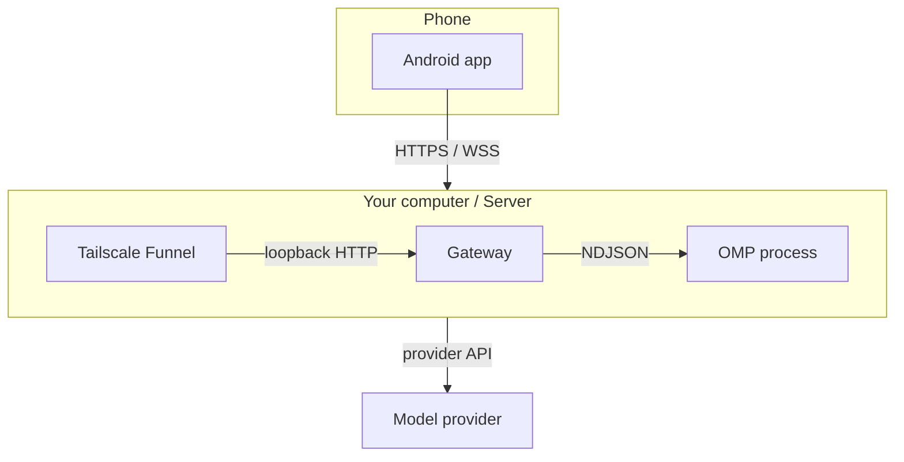

<p align="center"></p>

<h1 align="center">PinkCollab</h1>

<p align="center"><a href="https://3xian.github.io/PinkCollab/">PinkCollab</a>, <strong>Android client for Oh My Pi (OMP).</strong></p>

[OMP](https://omp.sh/) runs on your computer or server. Use the PinkCollab mobile app to start sessions and steer their progress.

<p align="center"></p>

## Install

Install the [Android app](https://github.com/3xian/PinkCollab/releases/latest/download/pinkcollab-android.apk) and PinkCollab CLI from the same release. The guided setup needs Node.js 18+, [OMP](https://omp.sh/), and [Tailscale](https://tailscale.com/download) on the host. Manual deployments can use Tailscale Serve or another HTTPS proxy.

```sh
npm install -g pinkcollab@latest
```

On macOS, we recommend the [Homebrew Tailscale CLI](https://formulae.brew.sh/formula/tailscale):

```sh
brew install tailscale
sudo brew services start tailscale
tailscale up
tailscale status
```

Complete Tailscale sign-in in your browser. If you already use Tailscale.app, you can keep using it.

From the directory containing your projects:

```sh
cd ~/projects
pinkcollab setup
```

Scan the QR code with the PinkCollab Android app. PinkCollab keeps the Gateway running in the background; you can close this terminal after pairing.

Setup guides Tailscale sign-in when needed. Your Tailscale account must permit Funnel. macOS starts the service when you log in; Linux user services start with your user session (see [logout behavior](docs/deployment.md#run-as-a-background-service)).

Running `pinkcollab` later shows host status. Rerun `pinkcollab setup` after upgrading the CLI or adding workspaces. Already paired phones are preserved; pairing another phone is optional.

<details>
<summary>Windows background service</summary>

Run setup in an Administrator terminal **as the same Windows user**. Windows requires that account's password (not a PIN) and the *Log on as a service* right. Setup explains the credentials prompt before opening it. If login fails, correct the account in Windows Services and rerun setup; keep your existing configuration. See [troubleshooting](docs/deployment.md#troubleshooting-guided-setup).

</details>


## Use

In the app, open **Workspaces**, choose a directory, create a session, and send a prompt. Use **Stop** to interrupt a turn and **Exit** to end its runtime.

- Pair another phone: `pinkcollab pair`.
- Check the host: `pinkcollab status`; diagnose problems: `pinkcollab doctor`.
- Add project roots: `pinkcollab setup --workspace /path/to/code --workspace /path/to/work`.
- Update the installed background Gateway after an npm upgrade: `pinkcollab setup` or `pinkcollab service install`.

Setup checks service ownership and listener conflicts before changing configuration or remote access. It can be repeated: it merges workspaces and preserves existing settings and paired devices. If a service update fails, resolve the reported error and rerun the same command; unfinished updates are retried. Applying changed configuration or upgrading the binary may restart the Gateway and stop active OMP runtimes; stored sessions remain.

`status` checks local Gateway health and OMP. It also verifies Funnel when configured by PinkCollab; other remote access is labeled externally managed and is not connectivity-tested.

For [manual setup](docs/deployment.md#tailscale-funnel), automation, service management, and troubleshooting, see [Deployment and networking](docs/deployment.md).

## How it works


```mermaid
flowchart TD
    subgraph phone [Phone]
        App[Android app]
    end
    subgraph host [Your computer / Server]
        direction LR
        Funnel[Tailscale Funnel]
        Gateway
        OMP[OMP process]
        Funnel -->|loopback HTTP| Gateway
        Gateway -->|NDJSON| OMP
    end
    Provider[Model provider]
    App -->|HTTPS / WSS| host
    host -->|provider API| Provider
```

## Docs

- [Architecture](docs/architecture.md): components, lifecycles, and state ownership
- [Protocol 3](docs/protocol.md): REST and WebSocket API contracts
- [Session presentation](docs/session-presentation.md): session UI, status display, and interaction behavior
- [Deployment and networking](docs/deployment.md): HTTPS access, pairing, background services, and Gateway CLI/configuration
- [Development](docs/development.md): contributor setup, builds, and validation
- [Releases](docs/npm-release.md): maintainer guide to signing and publishing Android, Gateway, and npm releases

## License

[MIT](LICENSE)
