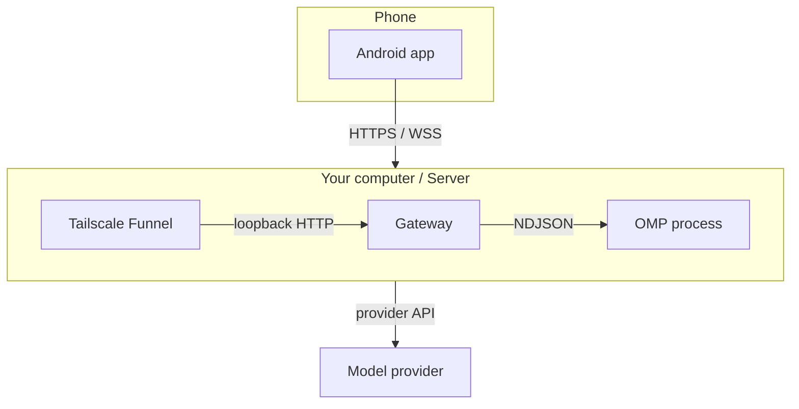

<p align="center"></p>

<h1 align="center">PinkCollab</h1>

<p align="center"><a href="https://3xian.github.io/PinkCollab/">PinkCollab</a>, <strong>Android client for Oh My Pi (OMP).</strong></p>

[OMP](https://omp.sh/) runs on your computer or server. Use the PinkCollab mobile app to start sessions and steer their progress.

<p align="center"></p>


```mermaid
flowchart TD
    subgraph phone [Phone]
        App[Android app]
    end
    subgraph host [Your computer / Server]
        direction LR
        Funnel[Tailscale Funnel]
        Gateway
        OMP[OMP process]
        Funnel -->|loopback HTTP| Gateway
        Gateway -->|NDJSON| OMP
    end
    Provider[Model provider]
    App -->|HTTPS / WSS| host
    host -->|provider API| Provider
```

## Install

Install the app and Gateway from the same release.

1. **Host:** Node.js 18+. Install Tailscale and allow Funnel for this node.
2. **Phone:** install the [release APK](https://github.com/3xian/PinkCollab/releases/latest/download/pinkcollab-android.apk).

```sh
npm install -g pinkcollab@latest
```

## Use

On the host, allow directories that already exist. On Windows, a path looks like `C:\code`. Repeat `--workspace` for each root you want to expose:

```sh
pinkcollab init --workspace /absolute/path/to/projects --workspace /another/root
pinkcollab funnel
pinkcollab serve
```

A later `init` fails once `config.yaml` exists. Add or remove roots by editing `workspaces` in `config.yaml` instead.

Leave that terminal open. In another terminal:

```sh
pinkcollab pair
```

Scan the QR in the app. Open **Workspaces**, choose one of the directories you allowed, create a session, and send a prompt.

In a session, the right-hand composer controls are **Stop** (interrupt the current turn), **Exit** (confirm before ending the runtime), and **Send** (submit the prompt).

The pairing code lasts five minutes and works once. If it expires, run `pair` again.

If Funnel is not allowed for this node, `funnel` stops. Enable the `funnel` attribute in the Tailscale admin console, then run it again.

## Docs

- [Architecture](docs/architecture.md) — components, lifecycles, and state ownership
- [Protocol v2](docs/protocol.md) — REST and WebSocket API contracts
- [Deployment and networking](docs/deployment.md) — HTTPS access, pairing, background services, and Gateway CLI/configuration
- [Development](docs/development.md) — contributor setup, builds, and validation
- [Releases](docs/npm-release.md) — maintainer guide to signing and publishing Android, Gateway, and npm releases

## License

[MIT](LICENSE)
