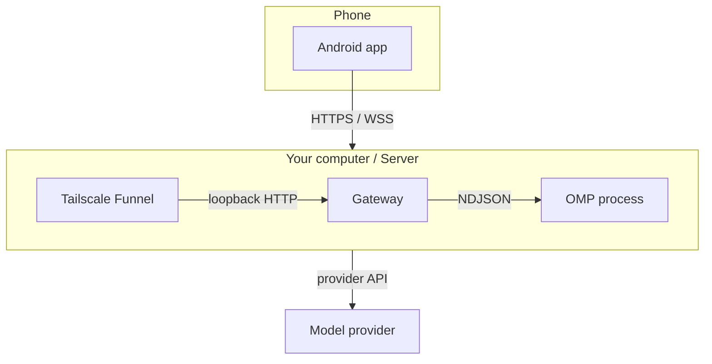

<p align="center"></p>

<h1 align="center">PinkCollab</h1>

<p align="center"><a href="https://3xian.github.io/PinkCollab/">PinkCollab</a>, <strong>Android client for Oh My Pi (OMP).</strong></p>

[OMP](https://omp.sh/) runs on your computer or server. Use the PinkCollab mobile app to start sessions and steer their progress.

<p align="center"></p>

## Install

Install the app and Gateway from the same release.

1. **Host:** Node.js 18+. Install Tailscale and allow Funnel for this node.
2. **Phone:** install the [release APK](https://github.com/3xian/PinkCollab/releases/latest/download/pinkcollab-android.apk).

```sh
npm install -g pinkcollab@latest
```

## Use

1. **Set up the host once.** Make sure `omp --version` works, then choose an existing directory for your projects:

   ```sh
   pinkcollab init --workspace /absolute/path/to/projects
   pinkcollab funnel
   ```

   On Windows, use a path such as `C:/code`. To allow more than one directory, repeat `--workspace` in the same `init` command. `funnel` sets up the public HTTPS address used by the phone.

2. **Start the Gateway.** Run this on the host and leave the terminal open while using the app:

   ```sh
   pinkcollab serve
   ```

3. **Pair your phone.** Open another terminal on the host and run:

   ```sh
   pinkcollab pair
   ```

   Scan the QR code in the PinkCollab app. The code can be used once within five minutes. Run `pinkcollab pair` again if it expires.

4. **Start a session.** In the app, open **Workspaces**, choose a directory, create a session, and send a prompt. Use **Stop** to interrupt the current turn, **Exit** to end the runtime after confirmation, and **Send** to submit a prompt.

For later use, start the Gateway with `pinkcollab serve` and open the app on your paired phone. To change the allowed directories, edit `workspaces` in `~/.pinkcollab/config.yaml`. `init` will not overwrite an existing configuration.

For Funnel permissions, connection troubleshooting, or running the Gateway in the background, see [Deployment and networking](docs/deployment.md).

## How it works


```mermaid
flowchart TD
    subgraph phone [Phone]
        App[Android app]
    end
    subgraph host [Your computer / Server]
        direction LR
        Funnel[Tailscale Funnel]
        Gateway
        OMP[OMP process]
        Funnel -->|loopback HTTP| Gateway
        Gateway -->|NDJSON| OMP
    end
    Provider[Model provider]
    App -->|HTTPS / WSS| host
    host -->|provider API| Provider
```

## Docs

- [Architecture](docs/architecture.md): components, lifecycles, and state ownership
- [Protocol 3](docs/protocol.md): REST and WebSocket API contracts
- [Session presentation](docs/session-presentation.md): session UI, status display, and interaction behavior
- [Deployment and networking](docs/deployment.md): HTTPS access, pairing, background services, and Gateway CLI/configuration
- [Development](docs/development.md): contributor setup, builds, and validation
- [Releases](docs/npm-release.md): maintainer guide to signing and publishing Android, Gateway, and npm releases

## License

[MIT](LICENSE)
