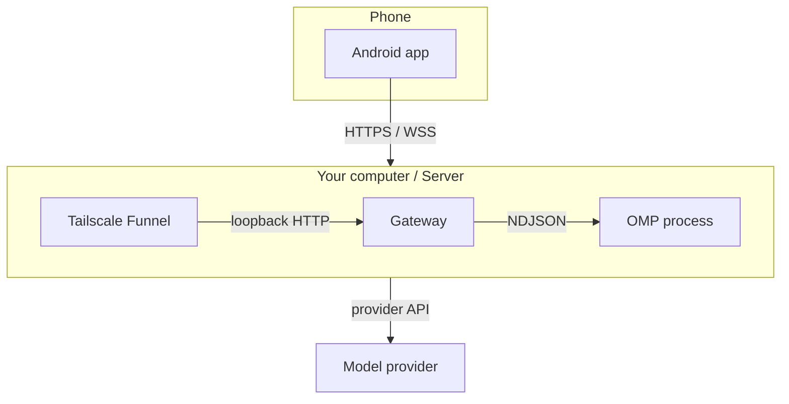

<p align="center"></p>

<h1 align="center">PinkCollab</h1>

[PinkCollab](https://3xian.github.io/PinkCollab/), **Android client for Oh My Pi (OMP).**

Use [OMP](https://omp.sh/) on your own computer from your Android phone.

- Read and continue existing OMP conversations without manually importing them.
- Start new sessions in your projects, send prompts, and switch between sessions.
- Keep OMP running on your host, using its own model-provider configuration.

Continuing a saved conversation is **not** a takeover of a running terminal session. Close the corresponding OMP instance on the host before continuing from your phone.

<p align="center"></p>

## Before you start

| Where | What you need |
| --- | --- |
| Android phone | The [PinkCollab APK](https://github.com/3xian/PinkCollab/releases/latest/download/pinkcollab-android.apk). |
| Computer running OMP | A working [OMP](https://omp.sh/) installation, Node.js 18+, and [Tailscale](https://tailscale.com/download) for guided setup. |
| Host account | Use the same OS user that owns your OMP configuration and conversations. `omp --version` must work for that user. |
| Remote connection | Guided setup uses Tailscale Funnel; your tailnet must permit Funnel for the host. |

**The default connection is public HTTPS.** Tailscale Funnel publishes the Gateway to the internet; app access requires pairing credentials. The URL itself is not a secret. Your phone does **not** need Tailscale for this path.

For private, tailnet-only access, use [manual Tailscale Serve setup](docs/deployment.md#other-https-front-ends); both the phone and host must join the tailnet. An existing HTTPS reverse proxy is also supported.

## Quick start

### 1. Prepare your host

Install OMP and Tailscale if needed. Setup guides Tailscale sign-in and Funnel approval, but does not install them.

<details>
<summary>macOS: Tailscale installation</summary>

We recommend the [Homebrew Tailscale CLI](https://formulae.brew.sh/formula/tailscale):

```sh
brew install tailscale
sudo brew services start tailscale
tailscale up
tailscale status
```

Complete Tailscale sign-in in your browser. If you already use Tailscale.app, you can keep using it.

</details>

<details>
<summary>Linux: background-service requirement</summary>

Guided setup uses a systemd user service. It starts with your user session and may stop when you log out. See [background-service behavior](docs/deployment.md#run-as-a-background-service) if the host must remain available after logout.

</details>

<details>
<summary>Windows: use an elevated terminal as your OMP user</summary>

Run setup in an Administrator terminal **as the same Windows user** who owns your OMP configuration and conversations. The background service requires that account's password (not a PIN) and the *Log on as a service* right. Setup explains the credentials prompt before opening it. For passwordless accounts or login failures, see [service requirements](docs/deployment.md#run-as-a-background-service) and [troubleshooting](docs/deployment.md#troubleshooting-setup).

</details>

### 2. Install the app and CLI

Install the [Android APK](https://github.com/3xian/PinkCollab/releases/latest/download/pinkcollab-android.apk) on your phone. On the host:

```sh
npm install -g pinkcollab@latest
npm list -g pinkcollab --depth=0
```

Use the APK and CLI from the **same release**. Compare the installed npm version with the tag on the [APK's release page](https://github.com/3xian/PinkCollab/releases/latest). If they differ, install `pinkcollab@X.Y.Z` instead of `pinkcollab@latest`, replacing `X.Y.Z` with that release's version without the leading `v`. This also applies when installing an older release.

### 3. Set up and pair

In your terminal, change to the directory containing the projects you want to access, then run:

```sh
pinkcollab setup
```

Setup asks you to confirm the current directory as a workspace root, configures remote access, and starts the Gateway as a background service. Scan its QR code with the PinkCollab Android app. You can close the terminal after pairing.

Choose a root that includes the projects used by your existing OMP conversations. To add multiple roots explicitly, use `pinkcollab setup --workspace /path/to/code --workspace /path/to/work`.

### 4. Send your first prompt

In the app, open an existing **History** entry in **Tasks** after closing its OMP instance on the host. Or open **Workspaces**, choose a directory, and create a new session. Send a prompt and confirm that OMP responds on the phone.

Pairing alone does not verify a working OMP session. If you cannot connect or get a response, run `pinkcollab doctor` and consult [setup troubleshooting](docs/deployment.md#troubleshooting-setup).

## Continue an existing OMP conversation

Supported host conversations appear as **History** in **Tasks**; no manual import is required. Open one to read its saved messages. **Close the corresponding external OMP instance before sending a message from the phone**, and do not reopen it elsewhere while PinkCollab owns its runtime. Concurrent use of the same conversation is unsupported.

If a conversation is missing:

- Ensure its project is inside a configured workspace root.
- Run the Gateway as the user who owns the conversation.
- Check the selected [OMP profile or custom session directory](docs/deployment.md#storage-selection).
- Reopen or reconnect the app to request a fresh snapshot; see [refresh and discovery limits](docs/deployment.md#refresh-and-discovery-limits).

## Start and control sessions

Open **Workspaces**, choose a directory, create a session, and send a prompt. Swipe to switch between sessions. Use **Stop** to interrupt a turn and **Exit** to end its runtime.

## Common commands and upgrades

| Task | Command |
| --- | --- |
| Check the host | `pinkcollab` or `pinkcollab status` |
| Diagnose problems | `pinkcollab doctor` |
| Pair another phone | `pinkcollab pair` |
| Add project roots | `pinkcollab setup --workspace /path/to/code --workspace /path/to/work` |
| Update the background Gateway after upgrading the CLI | `pinkcollab setup` or `pinkcollab service install` |

To upgrade, install the APK and npm package from the same release, then update the background Gateway. Repeating setup merges workspace roots and preserves existing settings, sessions, and paired phones; pairing another phone is optional. **Upgrading or applying changed configuration may restart the Gateway and stop active OMP runtimes.** Stored conversations remain.

If a service update fails, correct the reported error and rerun the same command; do not delete your configuration or pairing credentials. See [deployment and service management](docs/deployment.md) for update recovery and diagnostic details.

## Availability and security

- The host must remain awake and reachable. A background service does not keep the computer awake; see [macOS lid-close guidance](docs/faq-macos-lid-close.md).
- macOS starts the service at login. Linux user services may stop at logout; see [background-service behavior](docs/deployment.md#run-as-a-background-service).
- OMP runs with the Gateway user's filesystem permissions. Workspace roots limit Gateway browsing and session creation; **they are not an OS sandbox**.
- To revoke a phone's access, use `pinkcollab clients`, then `pinkcollab revoke --client <clientId>`. Removing a host in the app alone does not revoke its credentials.

See [pairing and access](docs/deployment.md#pairing-and-access) for authentication and access-control details.

## How it works


```mermaid
flowchart TD
    subgraph phone [Phone]
        App[Android app]
    end
    subgraph host [Your computer / Server]
        direction LR
        Funnel[Tailscale Funnel]
        Gateway
        OMP[OMP process]
        Funnel -->|loopback HTTP| Gateway
        Gateway -->|NDJSON| OMP
    end
    Provider[Model provider]
    App -->|HTTPS / WSS| host
    host -->|provider API| Provider
```

## User guides

- [Deployment and troubleshooting](docs/deployment.md): networking, pairing, background services, upgrades, and CLI/configuration
- [macOS lid-close FAQ](docs/faq-macos-lid-close.md): keeping the host reachable
- [Session interface](docs/session-presentation.md): status display and interaction behavior

## Developer docs

- [Architecture](docs/architecture.md): components, lifecycles, and state ownership
- [Protocol 3](docs/protocol.md): REST and WebSocket API contracts
- [Development](docs/development.md): contributor setup, builds, and validation
- [Releases](docs/npm-release.md): maintainer guide to signing and publishing Android, Gateway, and npm releases

## License

[MIT](LICENSE)
