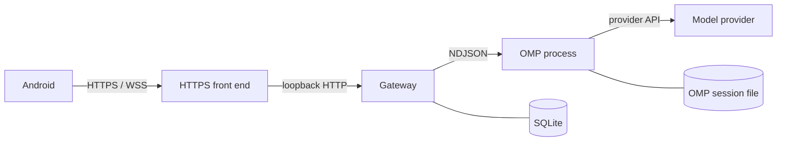

# Architecture

Why the pieces are split this way, what each one stores, and which failures they survive. Day-to-day consequences are in [usage](usage.md#after-a-disconnect-or-restart). The wire contract is in [protocol](protocol.md).

## Contents

- [Components](#components)
- [A session's lifetime](#a-sessions-lifetime)
- [Where data lives](#where-data-lives)
- [What a restart restores](#what-a-restart-restores)
- [Why OMP keeps the transcript](#why-omp-keeps-the-transcript)

## Components

| Piece | Role |
| --- | --- |
| Android app | Paired-host list, session pager, composer, attention card, model sheet. Holds the Gateway credential. Not a second agent. |
| HTTPS front end | Terminates TLS and forwards HTTP and WebSocket, including `Authorization`, to loopback. Not part of the Gateway binary. |
| Gateway | Authenticates devices, enforces the workspace allowlist, starts one OMP process per session, and fans events out to connected phones. |
| OMP | Plans, calls tools, and talks to the model provider with the host's existing configuration. |
| Model provider | Receives whatever OMP sends under that configuration. Outside the machine. |

The Gateway is a Rust service using Tokio and Axum. Android is Kotlin and Jetpack Compose. Those choices are implementation details. They are not the reason to install it.

PinkCollab does not replace OMP, attach to a process you started in a terminal, or relay traffic through a PinkCollab-operated cloud.

## A session's lifetime

1. The phone chooses a directory under an allowed root. The Gateway checks the path, then starts `omp --mode rpc-ui` with any configured `omp_args` in that directory. It waits up to 30 seconds for OMP's ready frame.
2. An omitted prompt leaves the session idle and attached. The first composer send is an ordinary prompt.
3. While the status is `running`, a further prompt is sent with `streamingBehavior=steer`. Otherwise it starts a new turn.
4. `agent_end` marks the session `completed`. `turn_end` does not. Completion does not detach the process.
5. **Interrupt** sends `abort`, sets `idle`, and keeps the process. **Stop** closes stdin, waits up to three seconds, then terminates the process and detaches it.
6. If the process exits on its own outside `completed` or `failed`, the session becomes `stopped`. A transport failure marks it `failed`.

`max_sessions` counts starting sessions and sessions with a live process. A completed-but-still-running session counts. The slot frees when the process is gone, not when the status word changes. See [reference](reference.md#max_sessions).

Commands against a detached runtime fail. The app disables them. The API returns 409.

## Where data lives

| Data | Where | Leaves the host? |
| --- | --- | --- |
| Host id, client token hashes, pairing-token hashes, session metadata, OMP session-file path | Gateway SQLite (`pinkcollab.db`, WAL) in the data directory | No, except that a paired phone learns the host id and session metadata over the API |
| Bearer credential | Phone, encrypted with Android Keystore; only a hash on the host | The phone must store it to reconnect. Revocation deletes the host-side hash. |
| Provider credentials and model configuration | OMP, on the host | OMP may send them, prompts, or code to the configured provider. PinkCollab does not copy them onto the phone. |
| Conversation and tool transcript | OMP's own session file | The phone receives the projection the Gateway serves. The file itself stays on the host. |
| Live timeline, streaming deltas, event sequence | Gateway memory, up to 500 timeline items | Sent to connected phones. Not written to SQLite. |
| Workspace files | The host filesystem | OMP can read and write them within the OS user's permissions. The allowlist does not stop that. |

SQLite does not store the transcript. The session row's `session_file` is not part of the JSON sent to clients.

The in-memory timeline and a reconstructed history share one retention rule: at most 500 items, dropping the oldest hidden tool bookkeeping before the oldest user, assistant, or error message.

## What a restart restores

| Event | Running OMP process | Session row | History you can read |
| --- | --- | --- | --- |
| Phone disconnects | Keeps running | Unchanged | Live view resumes from a new snapshot, not from missed deltas |
| Gateway restarts | Not restored. A graceful shutdown stops processes the Gateway owned | Live statuses become `offline` and detached. `completed`, `failed`, and `stopped` keep their status, also detached | Current branch of the OMP session file, if it is still there, including paired tool calls and results, subject to the 500-item rule |
| Host sleeps | Suspended with the machine. Not a PinkCollab resume feature | Unchanged until the Gateway process itself restarts | Unchanged |
| Host shuts down | Gone | On the next Gateway start, previously live sessions are offline | Whatever OMP wrote before shutdown |

History reconstruction walks `parentId` from the latest entry and keeps that branch. It is not a replay of the WebSocket. Arguments are present when the call itself is in the file; a result-only reconstruction can have `arguments: null`. Lines that cannot be parsed are skipped. A missing file yields an empty timeline rather than an error to the client.

"The file is on disk" does not mean the app can rebuild every live tool event, sequence number, or streaming draft.

## Why OMP keeps the transcript

The Gateway is a control plane for processes it starts. OMP already has a session log, provider setup, and tool runtime. Copying that log into SQLite would fork the record OMP itself continues. Leaving it in OMP's file means a Gateway upgrade does not migrate transcripts, and it also means PinkCollab cannot resurrect a process whose operating system has already reaped it.

That split is why a restart can show an old conversation and still refuse another prompt: the text survived, the runtime did not.

Next: [protocol](protocol.md) if you are building a client, or [deployment](deployment.md) if you are deciding who can open the HTTPS front end.
