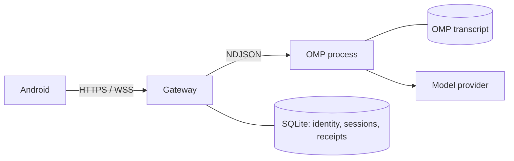

# Architecture

PinkCollab keeps OMP on the host. Android uses Gateway API v2 over HTTPS and WebSocket; the Gateway starts OMP through its local NDJSON RPC interface. See the [protocol](protocol.md) for wire details and [daily use](usage.md) for the app behavior.

## Three lifecycles

| Object | Identity | Owner | Lifetime |
| --- | --- | --- | --- |
| SessionRecord | `sessionId` | Gateway SQLite | Persistent conversation and display metadata; creating it does not start OMP |
| Runtime | `runtimeGeneration` | Gateway supervisor and OMP | One live process; a later resume uses a new generation |
| Operation | `clientId + sessionId + commandId` | Gateway SQLite | One user's command receipt; retrying its ID never dispatches it again |

The in-memory session controller owns each active session's runtime projection. Its `phase`, `execution`, pending inputs, model, and live messages come from actual process or OMP facts. A completed prompt can leave the process attached and the conversation ready for another prompt. A process slot is released only after confirmed exit. The Gateway checks the workspace again before every startup or resume. That allowlist governs browsing and runtime placement; it is not an operating system sandbox for OMP tools.

The supervisor drains OMP output independently of Android and uses a bounded frame reader. Stop is outside ordinary command dispatch, so a waiting prompt RPC cannot block process termination. Concurrent stops wait for confirmed process exit; a failed kill or wait leaves the runtime lease in place. On Windows, OMP is assigned to a Job Object, and stop confirms that the job is empty before releasing the slot. An unclean Gateway death leaves a durable lease; startup will refuse another writer to that session until the old process has been verified gone. A graceful Gateway shutdown stops processes it owns.

## Data ownership and recovery

| Data | Authority | Recovery behavior |
| --- | --- | --- |
| Host identity, pairing, SessionRecord, OMP mapping, Operation receipt | Gateway SQLite | Preserved across clean restart and v1-to-v2 migration |
| Conversation and tool transcript | OMP JSONL session file | Read on demand, by branch-bound pages; never copied into SQLite as another authority |
| Process state, pending input, current model, live preview | Live OMP process and Gateway memory | Rebuilt from a new snapshot while the process lives; absent after process exit |
| Android history pages | Local display cache | Valid only for the matching source and subscription |

An old Session can be resumed by starting a new runtime and loading its server-side OMP mapping. Old unfinished Operations are marked cancelled or outcome unknown on restart and are never sent again automatically. Missing or corrupt history is an explicit error. OMP history and the live WebSocket projection are separate reads, so they do not form a single atomic transcript snapshot.

The Gateway tracks `epoch` and `revision` per subscribed resource. The host summary list and each open session detail have separate cursors. Android replaces a resource with its subscription snapshot and accepts only contiguous changes. A reconnect takes a fresh snapshot; there is no persistent event replay. This avoids resolving concurrent REST and WebSocket updates by timestamps.

## Upgrade boundary

Gateway API v1 and Android v1 are incompatible with v2. The database migration creates a consistent pre-v2 backup, keeps identity and credentials, and extracts durable fields from old session JSON. It does not copy v1 runtime status into v2. The OMP session files are not moved or deleted. Stop the old Gateway before migration; restoring the pre-v2 backup is the rollback path for an old binary.
