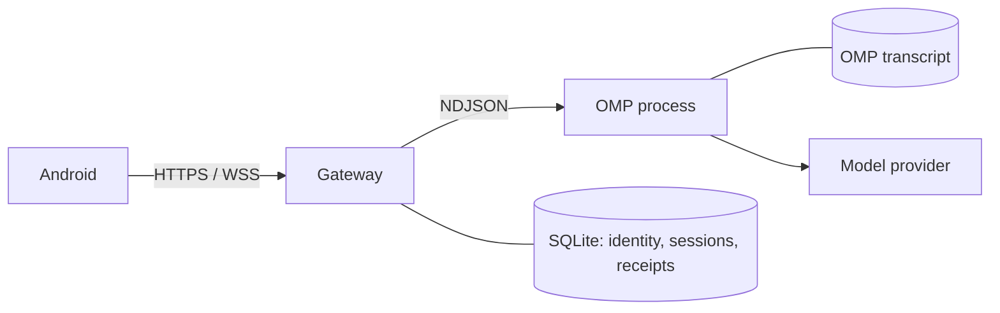

# Architecture

PinkCollab keeps OMP on the host. Android uses Gateway API v3 over HTTPS and WebSocket; the Gateway starts OMP through its local NDJSON RPC interface. See the [protocol](protocol.md) for wire details.

```mermaid
flowchart LR
    A[Android] -->|HTTPS / WSS| G[Gateway]
    G -->|NDJSON| O[OMP process]
    G --- S[(SQLite: identity, sessions, receipts)]
    O --- J[(OMP transcript)]
    O --> P[Model provider]
```

## Host background startup

Windows runs the Gateway as a detached process under the logged-in desktop user. Installation copies the executable to a stable user directory and writes a hidden Startup-folder launcher; no service account credentials are stored. Login starts it, closing the terminal or locking the screen leaves it running, and logout ends it. A named event prevents duplicate instances for the same data directory and signals graceful shutdown. The process record includes its creation time so a reused PID cannot identify an unrelated process. Existing Windows services are removed during an ownership-checked migration. macOS uses a launchd user agent; Linux uses a systemd user service. See [deployment](deployment.md#run-as-a-background-service) for management and migration.

## Three lifecycles

| Object | Identity | Owner | Lifetime |
| --- | --- | --- | --- |
| SessionRecord | `sessionId` | Gateway SQLite | Persistent conversation and display metadata; creating it does not start OMP |
| Runtime | `generation` | Gateway supervisor and OMP | One live process; a later resume uses a new generation |
| Operation | `clientId + sessionId + commandId` | Gateway SQLite | One user's command receipt; retrying its ID never dispatches it again |

The in-memory session controller owns each active session's runtime projection. Its `phase`, `execution`, pending inputs, model, and live messages come from actual process or OMP facts. A completed prompt can leave the process attached and the conversation ready for another prompt. A process slot is released only after confirmed exit. The Gateway checks the workspace again before every startup or resume. That allowlist governs browsing and runtime placement; it is not an operating system sandbox for OMP tools.

Detached-session reads use the persisted records directly; only existing active controllers overlay live state. Prompt-title persistence validates the runtime generation before committing. The committed record is then applied and published by increasing `metadataRevision`, even if that runtime has exited in the meantime.

The supervisor drains OMP output independently of Android and uses a bounded frame reader. Stop is outside ordinary command dispatch, so a waiting prompt RPC or blocked stdin write cannot prevent cleanup. Concurrent stops wait for confirmed process exit; a failed kill or wait leaves the runtime lease in place. On Windows, OMP is assigned to a named, kill-on-close Job Object created before its name is recorded in the durable runtime lease. On Unix, OMP starts in its own process group. Stop terminates descendants and verifies exit before releasing the slot. An unclean Gateway death leaves a durable lease. When a detached Windows session starts or receives a prompt, the Gateway automatically releases that exact old generation only if its recorded job no longer exists; an existing job, even if empty, still protects a possible startup. Lookup failures, legacy leases without job evidence, and Unix leases remain fail-closed and require verified manual recovery. A graceful Gateway shutdown stops processes it owns.

## Data ownership and recovery

| Data | Authority | Recovery behavior |
| --- | --- | --- |
| Host identity, pairing, SessionRecord, OMP mapping, Operation receipt | Gateway SQLite | Preserved across clean restart |
| Conversation and tool transcript | OMP JSONL session file | Read on demand, by branch-bound pages; never copied into SQLite as another authority |
| Delivered attention responses | Successful Gateway SQLite Respond receipts | Durable feedback items merged at their OMP branch anchors; independent of the recent-operation display limit |
| Process state, pending input, current model, live preview | Live OMP process and Gateway memory | Rebuilt from a new snapshot while the process lives; absent after process exit |
| Android history pages | Local display cache | Valid only for the matching source and local view |

An old Session can be resumed by starting a new runtime and loading its server-side OMP mapping. Before a prompt or attention response reaches OMP, the Gateway durably protects that mapping against replacement. A separate, monotonic file-expectation marker distinguishes feedback-only sessions from missing conversation history: prompts, uncertain response outcomes, and observation of an existing transcript require the file to remain available. A successfully delivered response before JSONL creation is anchored at the common root and remains readable without manufacturing an OMP file. Resume may replace an explicitly missing-allowed mapping and move its root feedback references in one transaction. Existing databases migrate conservatively: possibly written mappings require their files. Old unfinished Operations are marked cancelled or outcome unknown on restart and are never sent again automatically. Missing expected history and corrupt history are explicit errors. OMP history and the live WebSocket projection are separate reads, so they do not form a single atomic transcript snapshot.

Gateway internal state is richer than the public protocol. Public DTOs intentionally hide persistence and dispatch implementation details. The runtime projection maps internal phase/execution facts to one public state; receipt dispatch stages map to pending. Session metadata, runtime and operations are authoritative replacements; only the bounded live timeline uses patches.

Answering or cancelling an attention request writes one Gateway-owned `feedback` timeline item only after the response reaches OMP's stdin. Its successful receipt stores the original question, exact answer, delivery timestamp, transcript reference and branch insertion anchor. This is transport delivery, not proof that the model accepted or acted on the answer. Invalid, expired and failed writes create no item; an uncertain delivery/persistence outcome is never invented as feedback. Successful response receipts are retained as history, not disposable receipt-display cache.

Feedback does not modify or copy OMP's JSONL. History pages and synchronization merge it after its captured entry only while that entry is on the active branch, preserving existing message/tool positions. Response delivery, incoming-frame publication, history reads and startup remapping share a dedicated feedback-ordering gate so an answer-triggered assistant entry cannot advance the client's history anchor before its feedback is committed. The lifecycle-state mutex is released during disk and transport work; Stop, process-exit cleanup and session snapshots do not wait for the feedback gate. Stable feedback identities are identical live and restored; command replay cannot send or append them again.

The ordered WebSocket has no client-visible resource cursors. Typed protocol events define their session and host-list scope. Server-local sequence fences track those scopes and exclude events superseded by snapshots, with capture/publication ordered under controller locks. Broadcast lag, oversized events or failed capture close the connection. Android reconnects to a new host snapshot and resubscribes to the visible session. History remains a separate read with source-bound cursors. A subscribe may request a bounded first page alongside its session snapshot to avoid another connection and round trip; missing inline history falls back to REST, and earlier pages use REST. Local view tokens invalidate asynchronous history responses on unfocus, disconnect, or a fresh snapshot; they are never exchanged over the wire.

When Android returns to the foreground or its default network becomes available, it replaces host connections and obtains fresh snapshots, including connections still marked online, connecting, or synchronizing. Those states do not prove a socket survived background suspension or a network change. Authentication-required and upgrade-required hosts remain blocked until explicit user action. Recovery uses the existing subscription supervisor to cancel old connections and resubscribe to the visible session.

Each host makes at most three connection attempts in one cycle: the initial connection and two reconnects, one second apart. A later socket close uses one of those attempts; the cycle does not reset after a snapshot. After the third failure the host stays offline. It is shown offline between attempts, then synchronizing once a socket opens, until a fresh host snapshot arrives. Manual refresh, returning to the foreground, or the default network becoming available starts a new cycle.

A phone-local host name is stored with the pairing and shown in place of the Gateway name. Navigation keeps the Gateway host and exposes that phone name separately; it does not rewrite `Host.name`. Host snapshots replace the Gateway identity but keep the phone name. Setting the phone name back to the Gateway name removes the override.

## Android navigation

Android's Tasks screen places active sessions first, ordered by `createdAt DESC`, followed by inactive sessions ordered by `updatedAt DESC`. Its Timeline pager owns the selected page; the independently scrollable card strip above it follows that page and centers the selected card when space permits. The first card stays at the left edge instead of adding blank leading space. Tapping a card selects its Timeline page; dragging only the strip does not change the selection.

Tasks has one route-owned session-focus collector, active only while the app lifecycle is started. It begins during startup and loads the initial session as soon as a host snapshot supplies its summary, using the pager's ordering and the current restored selection when it exists. Settled pager selections feed the same collector; entering the pager reuses a pending request or valid subscription instead of forcing a second subscribe. Subsequent focus changes are debounced by 200 ms, and a new host snapshot reloads an invalidated subscription. Leaving Tasks or stopping the lifecycle cancels the snapshot wait and pending debounce, so a late startup snapshot cannot initiate focus from another route. Reentering Tasks resolves the current selection rather than replaying a startup capture.

Startup navigation waits for the task list to become ready or unavailable, without a fixed navigation timeout. Before the first usable host snapshot, connecting/reconnecting/synchronizing hosts remain on the animated startup screen and report progress at its bottom instead of switching to a second “Syncing sessions” page. Offline, authentication-required, and upgrade-required hosts make the list unavailable once no initial synchronization remains pending, releasing startup into the existing recovery interface. An empty synchronized snapshot and an unpaired app also release startup. This gate runs only once per app composition; subsequent reconnects use the normal task-list recovery flow. Previously synchronized session lists remain available across disconnects.

The startup screen centers the animated logo itself vertically and places the app name 20dp above its bounds; the title does not shift the logo downward. Connection and synchronization status text sits at the bottom, above the navigation-bar inset with 24dp of additional spacing. Its bounded history scrolls to the newest entry with a 1.2-second eased animation, following the measured content end rather than overshooting a list-item target. System animation-duration settings remain respected. It does not display an indeterminate loading bar.

All startup progress entries use the same base text opacity. A single vertical alpha mask fixed to the 108dp viewport fades text at its top and bottom edges; appending a status does not change the preceding entry's color or opacity.

Each compact session card displays the session title on its first line and the final component of its workspace path alongside the current status on its second line. Host names and position counters are not shown in the cards.

The model picker keeps an unset thinking level distinct from the first supported level. Until a supported level is selected, it offers explicit level buttons, including the first level; afterward, multi-level models use a slider with the model's supported-level indices. Apply sends only the user's selected changes.

Opening the model picker for an inactive session automatically starts OMP, then loads the model catalog once the runtime attaches. There is no default-versus-another-model confirmation step. `SessionOperations` owns each startup attempt across picker dismissal and reopening: command errors (including unconfirmed transport outcomes) and terminal receipts become retryable failures; only a ready subscription snapshot resolves a pending start. The picker derives progress and error presentation from that state instead of retaining its own startup flag.

Session detail separates retained conversation content from current-work status, attention requests, and command receipts. See the [Session Presentation Contract](session-presentation.md) for type catalogs, grouping rules, status precedence, visual behavior, and current support limitations. It defines Android's display policy without changing runtime or transcript ownership.

## Conversations created outside PinkCollab

`discovery::Discovery` adds read-only OMP historical entries to the existing session directory. `origin` explicitly distinguishes discovered and managed entries; discovered entries have no runtime. They are not stored as managed records until the first generation-less prompt/start. A SQLite transaction creates the SessionRecord, existing OMP reference and unique adoption association, retaining the public ID. Normal supervisor/receipt handling then resumes it. OMP remains the sole message/tool transcript authority; SQLite owns mappings, receipts and subsequently delivered attention feedback; Android owns only display/cache state.

Storage selection, bounded refresh, and external-writer limitations are documented in [Discovering host OMP conversations](deployment.md#discovering-host-omp-conversations).

## Provider quota display

Usage is a host resource, independent of session runtimes. Gateway reads the configured OMP executable's `usage --json` using the same explicit profile selection as runtimes and discovery, without forwarding runtime-only options. Finite usage commands share RPC process-tree containment: Unix process groups and Windows Jobs. A serialized owner retains the fetch slot through timeout/output-limit cleanup even if the requesting HTTP task is cancelled; successful reads are briefly cached and mapped to public quota DTOs with masked account labels.

Android's host usage loader merges completed fetches into current state atomically, preserving other hosts' pending/results and removals. Opening Usage from Models preserves the model settings draft and does not start an OMP conversation. Provider timestamps remain distinct from snapshot generation time, and missing reports remain unavailable rather than becoming zero usage.
