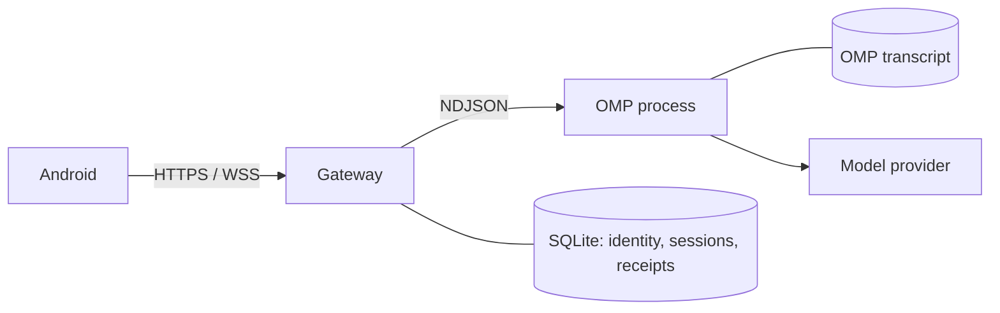

# Architecture

PinkCollab keeps OMP on the host. Android uses Gateway API v2 over HTTPS and WebSocket; the Gateway starts OMP through its local NDJSON RPC interface. See the [protocol](protocol.md) for wire details.

```mermaid
flowchart LR
    A[Android] -->|HTTPS / WSS| G[Gateway]
    G -->|NDJSON| O[OMP process]
    G --- S[(SQLite: identity, sessions, receipts)]
    O --- J[(OMP transcript)]
    O --> P[Model provider]
```

## Three lifecycles

| Object | Identity | Owner | Lifetime |
| --- | --- | --- | --- |
| SessionRecord | `sessionId` | Gateway SQLite | Persistent conversation and display metadata; creating it does not start OMP |
| Runtime | `runtimeGeneration` | Gateway supervisor and OMP | One live process; a later resume uses a new generation |
| Operation | `clientId + sessionId + commandId` | Gateway SQLite | One user's command receipt; retrying its ID never dispatches it again |

The in-memory session controller owns each active session's runtime projection. Its `phase`, `execution`, pending inputs, model, and live messages come from actual process or OMP facts. A completed prompt can leave the process attached and the conversation ready for another prompt. A process slot is released only after confirmed exit. The Gateway checks the workspace again before every startup or resume. That allowlist governs browsing and runtime placement; it is not an operating system sandbox for OMP tools.

Detached-session reads use the persisted records directly; only existing active controllers overlay live state. Prompt-title persistence validates the runtime generation before committing. The committed record is then applied and published by increasing `metadataRevision`, even if that runtime has exited in the meantime.

The supervisor drains OMP output independently of Android and uses a bounded frame reader. Stop is outside ordinary command dispatch, so a waiting prompt RPC or blocked stdin write cannot prevent cleanup. Concurrent stops wait for confirmed process exit; a failed kill or wait leaves the runtime lease in place. On Windows, OMP is assigned to a Job Object. On Unix, OMP starts in its own process group. Stop terminates descendants and verifies exit before releasing the slot. An unclean Gateway death leaves a durable lease; startup refuses another writer to that session until the old process has been verified gone. A graceful Gateway shutdown stops processes it owns.

## Data ownership and recovery

| Data | Authority | Recovery behavior |
| --- | --- | --- |
| Host identity, pairing, SessionRecord, OMP mapping, Operation receipt | Gateway SQLite | Preserved across clean restart |
| Conversation and tool transcript | OMP JSONL session file | Read on demand, by branch-bound pages; never copied into SQLite as another authority |
| Process state, pending input, current model, live preview | Live OMP process and Gateway memory | Rebuilt from a new snapshot while the process lives; absent after process exit |
| Android history pages | Local display cache | Valid only for the matching source and subscription |

An old Session can be resumed by starting a new runtime and loading its server-side OMP mapping. Before any prompt RPC can reach OMP, the Gateway durably records that the mapped reference may contain history; this stays true after aborted, failed, unknown, or even `agentInvoked:false` outcomes. A mapped session with no possible prompt write may have acquired a reference before OMP writes a JSONL file; only that absent file is empty history, and resume can replace the mapping under an atomic unwritten guard. Legacy mapped sessions and older sessions with prompt receipts migrate conservatively. Old unfinished Operations are marked cancelled or outcome unknown on restart and are never sent again automatically. Missing history for a possibly written mapping, or corrupt history, is an explicit error. OMP history and the live WebSocket projection are separate reads, so they do not form a single atomic transcript snapshot.

The Gateway tracks `epoch` and `revision` per subscribed resource. The host summary list and each open session detail have separate cursors. Android replaces a resource with its subscription snapshot and accepts only contiguous changes. A reconnect takes a fresh snapshot; there is no persistent event replay. This avoids resolving concurrent REST and WebSocket updates by timestamps.

Android invalidates session subscription ownership on unfocus, unsubscribe, and connection loss without evicting the last visible transcript. History settlement waits end when that ownership changes, and responses from the old subscription cannot update the new one.

## Android navigation

Android's Tasks screen orders sessions by creation time. Its Timeline pager owns the selected page; the independently scrollable card strip above it follows that page and centers the selected card when space permits. The first card stays at the left edge instead of adding blank leading space. Tapping a card selects its Timeline page; dragging only the strip does not change the selection.

Each compact session card displays the session title on its first line and the final component of its workspace path alongside the current status on its second line. Host names and position counters are not shown in the cards.

The model picker keeps an unset thinking level distinct from the first supported level. Until a supported level is selected, it offers explicit level buttons, including the first level; afterward, multi-level models use a slider with the model's supported-level indices. Apply sends only the user's selected changes.

Session detail separates retained conversation content from current-work status, attention requests, and command receipts. See the [Session Presentation Contract](session-presentation.md) for type catalogs, grouping rules, status precedence, visual behavior, and current support limitations. It defines Android's display policy without changing runtime or transcript ownership.

