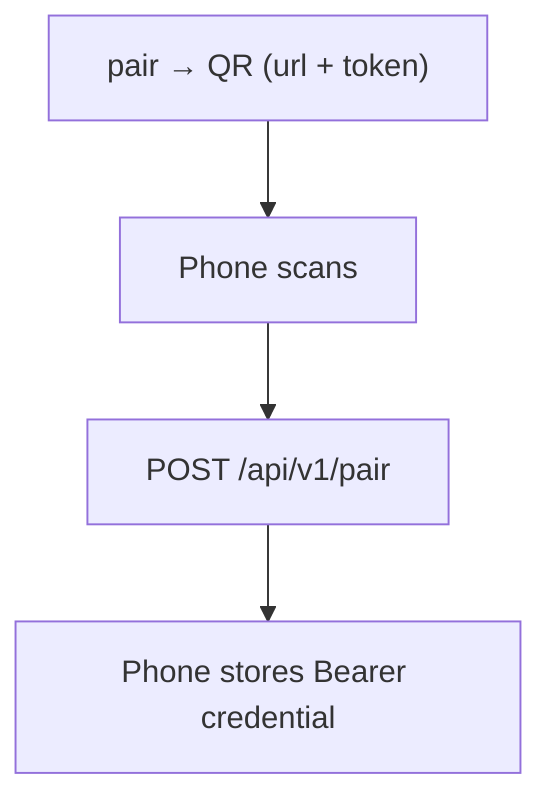

# Deployment and networking

This guide covers HTTPS access to the Gateway, pairing, and running it as a background service. For installation and the first task, follow the repository [Quick start](../README.md#quick-start); use the front-end options below for its HTTPS step.

## Connect Android

Android requires **HTTPS/WSS**. Plain HTTP is allowed only in debug builds for `localhost`, `127.0.0.1`, and the emulator host `10.0.2.2`.

The Gateway **always listens on loopback and never handles TLS**; something in front of it terminates HTTPS and forwards to `127.0.0.1:8787`. That front end is the only thing you pick:


| Front end | Reachable from | Phone needs |
| --- | --- | --- |
| **Tailscale Funnel** | The public internet | Nothing at all |
| **Tailscale Serve** | Your tailnet only | Tailscale, same tailnet |
| **Your own reverse proxy** | Whatever you expose | Whatever that proxy requires |

Only two Gateway keys matter here — `listen` (loopback) and `public_url` (what the phone dials).

### Tailscale Funnel — public, simplest

Tailscale terminates TLS and forwards to the loopback Gateway, so **no certificate is needed anywhere**:

```yaml
listen: 127.0.0.1:8787
public_url: https://my-host.example-tailnet.ts.net
```

```sh
pinkcollab setup-funnel --pair             # publishes the port, writes public_url, prints a code
# equivalent, minus the pairing code:
#   tailscale funnel --bg --https=443 --yes http://127.0.0.1:8787
tailscale funnel status
```

`setup-funnel` flags: `--dry-run` prints the plan without changing anything, `--https 8443` picks a non-default public port, `--tailscale <path>` points at the CLI when it is not on `PATH`.

Caveats:

- The tailnet policy must grant this node the `funnel` attribute. *Otherwise the CLI stops with `Funnel not available; "funnel" node attribute not set`.*
- Funnel serves HTTPS on **443, 8443 or 10000** only; a non-default port belongs in `public_url`, e.g. `https://…ts.net:8443`.
- Funnel and Tailscale Serve share one configuration — publishing replaces a Serve mapping on the same port. `tailscale funnel --https=443 off` removes it.
- **The endpoint is public.** Reachability is not security: tokens stay single-use and short-lived, credentials stay revocable, the workspace allowlist still applies, and every REST call and WebSocket upgrade still requires authorization. Never rely on the `.ts.net` hostname staying secret.

### Tailscale Serve — private

Both devices run Tailscale in the same tailnet, and **nothing is exposed to the internet**. Tailscale terminates TLS exactly as with Funnel, but only serves your tailnet:

```sh
tailscale serve --bg http://127.0.0.1:8787
```

```yaml
listen: 127.0.0.1:8787
public_url: https://<hostname>.ts.net
```

### Your own reverse proxy

Caddy, nginx, or any HTTPS tunnel: it owns the certificate and the public or LAN address, and forwards to the loopback Gateway.

```yaml
listen: 127.0.0.1:8787
public_url: https://dev-server.example.com
```

- The proxy must forward **WebSocket Upgrade** and the **`Authorization`** header, with `127.0.0.1:8787` as upstream. *(why: live updates ride on the WebSocket, and it authenticates separately from REST.)*
- For LAN-only use, let the proxy bind the LAN address and reserve it in your router — if it changes, pairing breaks.
- Android must trust the proxy's certificate chain. *(why: Android rejects self-signed chains by default.)*

## Pairing and security



- The QR carries only the Gateway root URL and a one-time token.
- `pair` uses an explicit `--url` or the configured `public_url`. If neither exists it stops with instructions instead of guessing from Tailscale node identity or producing an unreachable loopback URL. Pairing JSON stays on stdout for scripts; the QR is shown only when stderr is a terminal, and `--qr <file>` also writes a PNG.
- `/api/v1/pair` is the **only** endpoint reachable without a credential. *(why: the phone has nothing to authenticate with yet, so trust has to start somewhere.)*
- Everything else — including the WebSocket — returns `401` without a valid `Bearer` credential.

| Token rule | Value |
| --- | --- |
| Lifetime | 5 minutes |
| Successful uses | 1 — consumed on success |

*Why so tight: the 192-bit random code is the only thing between the internet and your host until pairing succeeds, so it is short-lived and consumed transactionally on first use.*

```sh
pinkcollab pair                        # code for the configured public_url
pinkcollab pair --qr pairing.png       # ... and a PNG for another screen
pinkcollab clients                     # clientId, name, pairing time
pinkcollab revoke --client client_xxx  # fails when the id does not exist
```

Removing a pairing in Android only clears the phone's local copy — use `revoke` to actually cut host-side access.

## Run as a background service

Run the service as the same regular OS user that owns `~/.pinkcollab` and the workspaces. Do not point a long-lived service at npm's global installation tree: npm can replace or remove that tree during an update. Copy the installed platform binary to a stable per-user location instead.

On Linux:

```sh
platform_package="@pinkcollab/gateway-linux-$(node -p 'process.arch')"
package_root="$(npm root -g)/pinkcollab"
platform_manifest="$(node -e 'console.log(require.resolve(process.argv[1] + "/package.json", { paths: [process.argv[2]] }))' "$platform_package" "$package_root")"
install -Dm755 "$(dirname "$platform_manifest")/bin/pinkcollab-gateway" \
  ~/.local/share/pinkcollab/bin/pinkcollab-gateway
```

`init` already wrote an absolute `omp` path into `config.yaml`, so OMP only has to stay where it is; the service still sets `PATH` because that path is usually a launcher script that resolves `bun` or `node` from a shell environment a service manager does not inherit.

### Windows

```powershell
$stableDir = Join-Path $env:LOCALAPPDATA "PinkCollab/bin"
New-Item -ItemType Directory -Force $stableDir | Out-Null
$packageRoot = Join-Path (npm root -g) "pinkcollab"
$platformManifest = node -e "console.log(require.resolve('@pinkcollab/gateway-win32-x64/package.json', { paths: [process.argv[1]] }))" $packageRoot
Copy-Item (Join-Path (Split-Path $platformManifest) "bin/pinkcollab-gateway.exe") $stableDir
sc.exe create PinkCollab binPath= "`"$stableDir\pinkcollab-gateway.exe`" --data-dir `"$env:USERPROFILE\.pinkcollab`" service" start= auto
```

Then open **Services → PinkCollab → Properties → Log On**, switch the account from LocalSystem to that user, grant *Log on as a service*, and start it. *(why: the Gateway and OMP need that user's credentials and file permissions; LocalSystem has neither.)*

```powershell
sc.exe start PinkCollab
sc.exe stop PinkCollab
```

### Linux (systemd)

Write `~/.config/systemd/user/pinkcollab.service`:

```ini
[Unit]
Description=PinkCollab Oh My Pi Gateway
After=network-online.target
Wants=network-online.target

[Service]
Type=simple
ExecStart=%h/.local/share/pinkcollab/bin/pinkcollab-gateway --data-dir %h/.pinkcollab serve
Environment=PATH=%h/.local/bin:%h/.bun/bin:/usr/local/bin:/usr/bin:/bin
Restart=on-failure
RestartSec=5
TimeoutStopSec=45
UMask=0077

[Install]
WantedBy=default.target
```

```sh
systemctl --user daemon-reload
systemctl --user enable --now pinkcollab
journalctl --user -u pinkcollab -f
```

Add `loginctl enable-linger YOUR_USER` to keep it running after logout.

### macOS (launchd)

Copy the npm-installed binary to a stable location:

```sh
platform_package="@pinkcollab/gateway-darwin-$(node -p 'process.arch')"
package_root="$(npm root -g)/pinkcollab"
platform_manifest="$(node -e 'console.log(require.resolve(process.argv[1] + "/package.json", { paths: [process.argv[2]] }))' "$platform_package" "$package_root")"
mkdir -p "$HOME/Library/Application Support/PinkCollab/bin"
cp "$(dirname "$platform_manifest")/bin/pinkcollab-gateway" \
  "$HOME/Library/Application Support/PinkCollab/bin/pinkcollab-gateway"
chmod 755 "$HOME/Library/Application Support/PinkCollab/bin/pinkcollab-gateway"
```

Write `~/Library/LaunchAgents/dev.pinkcollab.gateway.plist`, replacing `YOUR_USER`:

```xml
<?xml version="1.0" encoding="UTF-8"?>
<!DOCTYPE plist PUBLIC "-//Apple//DTD PLIST 1.0//EN" "http://www.apple.com/DTDs/PropertyList-1.0.dtd">
<plist version="1.0"><dict>
    <key>Label</key><string>dev.pinkcollab.gateway</string>
    <key>ProgramArguments</key><array>
        <string>/Users/YOUR_USER/Library/Application Support/PinkCollab/bin/pinkcollab-gateway</string>
        <string>--data-dir</string><string>/Users/YOUR_USER/.pinkcollab</string>
        <string>serve</string>
    </array>
    <key>EnvironmentVariables</key><dict>
        <key>PATH</key><string>/Users/YOUR_USER/.local/bin:/Users/YOUR_USER/.bun/bin:/opt/homebrew/bin:/usr/local/bin:/usr/bin:/bin</string>
    </dict>
    <key>RunAtLoad</key><true/>
    <key>KeepAlive</key><dict><key>SuccessfulExit</key><false/></dict>
    <key>StandardOutPath</key><string>/Users/YOUR_USER/.pinkcollab/gateway.log</string>
    <key>StandardErrorPath</key><string>/Users/YOUR_USER/.pinkcollab/gateway-error.log</string>
</dict></plist>
```

```sh
launchctl bootstrap gui/$(id -u) ~/Library/LaunchAgents/dev.pinkcollab.gateway.plist
launchctl kickstart -k gui/$(id -u)/dev.pinkcollab.gateway
```

### Updates

After `npm install -g pinkcollab@latest`, stop the service, repeat the platform-specific copy above, and start it again. For a Gateway built from source, rebuild it ([README: Build the Gateway from source](../README.md#build-the-gateway-from-source)) and copy the fresh `gateway/target/release/pinkcollab-gateway` from the repository root over the installed binary. Identity and credentials survive — they live in SQLite (WAL), not in the binary. A graceful shutdown also stops the OMP runtimes the Gateway started.

Configs written before embedded TLS was removed must drop `tls_cert` and `tls_key` entirely — the Gateway rejects any config that still sets them — and move TLS termination to Funnel, Serve, or a reverse proxy.
