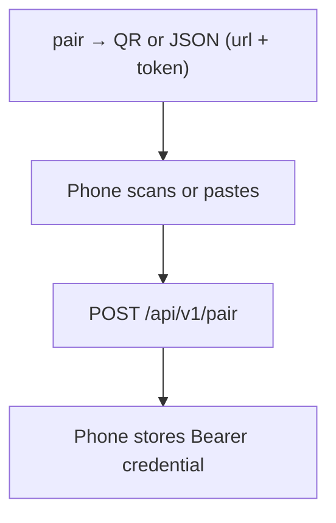

# Deployment and networking

Choose how a phone reaches the Gateway, how a device is granted and revoked, and how the process stays up. Installation of the first session is the [README](../README.md). Command defaults are in [reference](reference.md).

The Gateway always listens on loopback and never terminates TLS. Something in front of it presents HTTPS and forwards to `http://127.0.0.1:8787`.


## Contents

- [Choose a front end](#choose-a-front-end)
- [Tailscale Serve](#tailscale-serve-private)
- [Tailscale Funnel](#tailscale-funnel)
- [Your own reverse proxy](#your-own-reverse-proxy)
- [Pairing and security](#pairing-and-security)
- [Run as a background service](#run-as-a-background-service)
- [Updates](#updates)
- [When something fails](#when-something-fails)

## Choose a front end

The [README](../README.md) uses Tailscale Funnel. Serve and your own proxy are the other choices.

| Front end | Who can connect | You need | Tradeoff |
| --- | --- | --- | --- |
| **Tailscale Serve** | The phone, at the host's Tailscale HTTPS name | Tailscale on the host | Private. No certificate to install on the Gateway. The phone does not install Tailscale. |
| **Tailscale Funnel** (default) | The public internet | Funnel allowed for this node | No certificate to install on the Gateway. The endpoint is public; the hostname is not a secret. |
| **Your own reverse proxy** | Whatever that proxy exposes | A certificate the phone trusts, plus WebSocket and `Authorization` forwarding | Fits an existing HTTPS name. You operate the proxy. |

Only two Gateway keys matter here: `listen` (loopback) and `public_url` (the root the phone dials). Neither Serve nor Funnel is implied by `pinkcollab serve`.

<a id="connect-android"></a>

Android release builds require HTTPS. Plain HTTP is accepted only by debug builds, and only for `localhost`, `127.0.0.1`, and the emulator host `10.0.2.2`.

## Tailscale Serve — private

Tailscale runs on the host. Nothing is published to the public internet. Tailscale terminates TLS; you do not install or renew a certificate file on the Gateway. The phone opens the HTTPS URL. It does not install Tailscale.

```sh
tailscale serve --bg http://127.0.0.1:8787
tailscale serve status
```

```yaml
listen: 127.0.0.1:8787
public_url: https://<hostname>.ts.net
```

Use that `https://<hostname>.ts.net` root with `pinkcollab pair`.

## Tailscale Funnel

<a id="tailscale-funnel-public-simplest"></a>

Funnel is the public option, and the one the README uses. Tailscale terminates TLS and forwards to the loopback Gateway, so you still do not manage a certificate file yourself. The connection has a certificate. Reachability is not access control.

```yaml
listen: 127.0.0.1:8787
public_url: https://my-host.example-tailnet.ts.net
```

```sh
pinkcollab setup-funnel --pair
# equivalent, without minting a pairing code:
#   tailscale funnel --bg --https=443 --yes http://127.0.0.1:8787
tailscale funnel status
```

`setup-funnel` flags: `--dry-run` prints the plan and changes nothing, `--https 8443` selects a non-default public port, `--tailscale <path>` points at the CLI when it is not on `PATH`, `--pair` prints a pairing code after publish.

Constraints:

- The tailnet policy must grant this node the `funnel` attribute. Otherwise the CLI stops with `Funnel not available; "funnel" node attribute not set`.
- Funnel serves HTTPS on **443, 8443, or 10000** only. A non-default port belongs in `public_url`, for example `https://…ts.net:8443`.
- Funnel and Tailscale Serve share one configuration. Publishing replaces a Serve mapping on the same port. `tailscale funnel --https=443 off` removes it.
- **The endpoint is public.** Tokens stay single-use and short-lived, credentials stay revocable, the workspace allowlist still applies, and every REST call and WebSocket upgrade still requires authorization. Do not rely on the `.ts.net` hostname staying secret.

## Your own reverse proxy

Caddy, nginx, or another HTTPS front end owns the certificate and the public or LAN address, and forwards to the loopback Gateway.

```yaml
listen: 127.0.0.1:8787
public_url: https://dev-server.example.com
```

- The proxy must forward **WebSocket Upgrade** and the **`Authorization`** header, with `http://127.0.0.1:8787` as upstream. Live updates use the WebSocket, and that socket authenticates separately from a page load.
- For LAN-only use, give the proxy a stable address. If the address changes, existing pairings still hold the old URL until you pair again.
- Android must trust the proxy's certificate chain. A self-signed chain is rejected by default.

## Pairing and security



- The QR carries the Gateway root URL and a one-time token. It does not carry provider credentials.
- `pair` uses `--url` or the configured `public_url`. If neither exists it stops, instead of guessing from Tailscale or printing a loopback URL. JSON stays on stdout. The QR is shown when stderr is a terminal. `--qr <file>` also writes a PNG.
- `/api/v1/pair` is the only endpoint reachable without a credential. Everything else, including the WebSocket, returns 401 without a valid `Bearer` token. Tokens are not accepted in the query string. A request that carries an `Origin` header is rejected; this API is not a browser client.
- The pairing token lives five minutes and is consumed by one successful pair. After a failure or expiry, run `pair` again.

```sh
pinkcollab pair --url https://gateway.example.com
pinkcollab pair --qr pairing.png
pinkcollab clients
pinkcollab revoke --client client_xxx
```

`revoke` fails when the id does not exist. Run `clients` first. Removing a host in Android clears the phone's local copy only. The host keeps accepting that credential until you revoke it here, using the same user and data directory that issued it.

The workspace allowlist limits which directories the Gateway will list and start sessions in. OMP then runs as the OS user that started the Gateway, with that user's permissions. A prompt is not a sandbox.

OMP sends model traffic according to its own provider configuration. Keeping provider credentials off the phone does not keep prompts, code, or those credentials off the provider.

## Run as a background service

Run the service as the same regular OS user that owns `~/.pinkcollab` and the workspaces. Do not point a long-lived service at npm's global installation tree: npm can replace or remove that tree during an update. Copy the installed platform binary to a stable per-user location instead.

`init` writes an absolute `omp` path. OMP has to stay at that path. The service still needs a `PATH` that can satisfy a launcher script: the recorded `omp` often resolves `bun` or `node` from a shell environment the service manager does not inherit.

On Linux, copy the binary before writing the unit:

```sh
platform_package="@pinkcollab/gateway-linux-$(node -p 'process.arch')"
package_root="$(npm root -g)/pinkcollab"
platform_manifest="$(node -e 'console.log(require.resolve(process.argv[1] + "/package.json", { paths: [process.argv[2]] }))' "$platform_package" "$package_root")"
install -Dm755 "$(dirname "$platform_manifest")/bin/pinkcollab-gateway" \
  ~/.local/share/pinkcollab/bin/pinkcollab-gateway
```

### Windows

```powershell
$stableDir = Join-Path $env:LOCALAPPDATA "PinkCollab/bin"
New-Item -ItemType Directory -Force $stableDir | Out-Null
$packageRoot = Join-Path (npm root -g) "pinkcollab"
$platformManifest = node -e "console.log(require.resolve('@pinkcollab/gateway-win32-x64/package.json', { paths: [process.argv[1]] }))" $packageRoot
Copy-Item (Join-Path (Split-Path $platformManifest) "bin/pinkcollab-gateway.exe") $stableDir
sc.exe create PinkCollab binPath= "`"$stableDir\pinkcollab-gateway.exe`" --data-dir `"$env:USERPROFILE\.pinkcollab`" service" start= auto
```

Then open **Services → PinkCollab → Properties → Log On**, switch the account from LocalSystem to that user, grant *Log on as a service*, and start it. The Gateway and OMP need that user's files and credentials. LocalSystem has neither.

```powershell
sc.exe start PinkCollab
sc.exe stop PinkCollab
```

The `service` subcommand is Windows-only. The Service Control Manager is what starts it.

### Linux (systemd)

Write `~/.config/systemd/user/pinkcollab.service`:

```ini
[Unit]
Description=PinkCollab Oh My Pi Gateway
After=network-online.target
Wants=network-online.target

[Service]
Type=simple
ExecStart=%h/.local/share/pinkcollab/bin/pinkcollab-gateway --data-dir %h/.pinkcollab serve
Environment=PATH=%h/.local/bin:%h/.bun/bin:/usr/local/bin:/usr/bin:/bin
Restart=on-failure
RestartSec=5
TimeoutStopSec=45
UMask=0077

[Install]
WantedBy=default.target
```

```sh
systemctl --user daemon-reload
systemctl --user enable --now pinkcollab
journalctl --user -u pinkcollab -f
```

Add `loginctl enable-linger YOUR_USER` to keep the user service running after logout. Linger keeps the Gateway process up. It does not keep the machine awake, and it does not restore OMP processes after a reboot.

### macOS (launchd)

Copy the npm-installed binary to a stable location:

```sh
platform_package="@pinkcollab/gateway-darwin-$(node -p 'process.arch')"
package_root="$(npm root -g)/pinkcollab"
platform_manifest="$(node -e 'console.log(require.resolve(process.argv[1] + "/package.json", { paths: [process.argv[2]] }))' "$platform_package" "$package_root")"
mkdir -p "$HOME/Library/Application Support/PinkCollab/bin"
cp "$(dirname "$platform_manifest")/bin/pinkcollab-gateway" \
  "$HOME/Library/Application Support/PinkCollab/bin/pinkcollab-gateway"
chmod 755 "$HOME/Library/Application Support/PinkCollab/bin/pinkcollab-gateway"
```

Write `~/Library/LaunchAgents/dev.pinkcollab.gateway.plist`, replacing `YOUR_USER`:

```xml
<?xml version="1.0" encoding="UTF-8"?>
<!DOCTYPE plist PUBLIC "-//Apple//DTD PLIST 1.0//EN" "http://www.apple.com/DTDs/PropertyList-1.0.dtd">
<plist version="1.0"><dict>
    <key>Label</key><string>dev.pinkcollab.gateway</string>
    <key>ProgramArguments</key><array>
        <string>/Users/YOUR_USER/Library/Application Support/PinkCollab/bin/pinkcollab-gateway</string>
        <string>--data-dir</string><string>/Users/YOUR_USER/.pinkcollab</string>
        <string>serve</string>
    </array>
    <key>EnvironmentVariables</key><dict>
        <key>PATH</key><string>/Users/YOUR_USER/.local/bin:/Users/YOUR_USER/.bun/bin:/opt/homebrew/bin:/usr/local/bin:/usr/bin:/bin</string>
    </dict>
    <key>RunAtLoad</key><true/>
    <key>KeepAlive</key><dict><key>SuccessfulExit</key><false/></dict>
    <key>StandardOutPath</key><string>/Users/YOUR_USER/.pinkcollab/gateway.log</string>
    <key>StandardErrorPath</key><string>/Users/YOUR_USER/.pinkcollab/gateway-error.log</string>
</dict></plist>
```

```sh
launchctl bootstrap gui/$(id -u) ~/Library/LaunchAgents/dev.pinkcollab.gateway.plist
launchctl kickstart -k gui/$(id -u)/dev.pinkcollab.gateway
```

## Updates

After `npm install -g pinkcollab@latest`, stop the service, repeat the platform-specific copy above, and start it again. For a Gateway built from source, rebuild it ([Development](development.md#build-the-gateway)) and copy the fresh `gateway/target/release/pinkcollab-gateway` over the installed binary.

Identity and credentials survive a binary replacement. They live in SQLite in the data directory, not in the binary. A graceful shutdown stops the OMP runtimes the Gateway started. Starting the new binary does not resume them. Sessions that were live show as offline. See [what a restart restores](architecture.md#what-a-restart-restores).

Configs written before embedded TLS was removed must drop `tls_cert` and `tls_key`. The Gateway rejects a file that still sets them.

## When something fails

There is no separate diagnostic subcommand. Use `status` only while the Gateway is stopped.

| What you see | What to check |
| --- | --- |
| `status` says the listen port is unavailable | The Gateway is already running, or another process holds the port. This check is not a liveness probe. |
| `status` says OMP is unavailable | `omp` is missing for this user, or the absolute path in `config.yaml` no longer exists. |
| `pair` stops before printing a code | Pass `--url https://…`, or set `public_url`. The command will not invent an address. |
| The phone cannot open the URL | You pasted `127.0.0.1`, Serve or Funnel is not running, or the proxy certificate is not trusted. |
| Pairing returns invalid or expired | The code is older than five minutes, or a previous attempt already consumed it. Run `pair` again. |
| The app says the protocol version is unsupported | The APK and Gateway are not both speaking protocol 1. Use a matching pair. |
| Live updates die behind a proxy | The proxy is not forwarding `Upgrade` and `Authorization`. |
| The service starts, then sessions fail to launch OMP | The service account is wrong, or `PATH` cannot satisfy the OMP launcher even though `omp` is absolute. |
| An old config fails on startup | Remove `tls_cert` and `tls_key`, and keep `listen` on loopback. |
| Removing the host on the phone did not lock it out | Expected. Revoke on the host. |

Next: [daily use](usage.md) once the phone is paired, or [architecture](architecture.md) if you need the restart and storage rules in one place.
