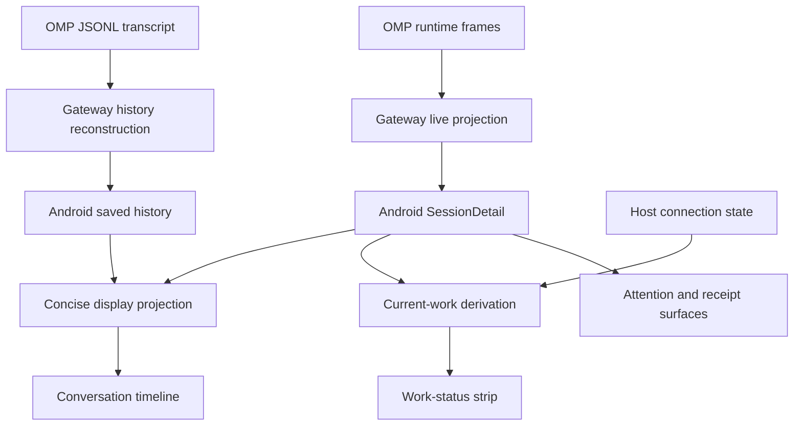

# Session Presentation Contract

## Contents

1. [Scope and terminology](#1-scope-and-terminology)
2. [Data flow and ownership](#2-data-flow-and-ownership)
3. [Source type catalog](#3-source-type-catalog)
4. [Display type catalog](#4-display-type-catalog)
5. [Tool activity contract](#5-tool-activity-contract)
6. [Current-work contract](#6-current-work-contract)
7. [Attention, command notices, and loading states](#7-attention-command-notices-and-loading-states)
8. [Visual and interaction rules](#8-visual-and-interaction-rules)
9. [Acceptance scenarios](#9-acceptance-scenarios)
10. [Extension checklist and implementation map](#10-extension-checklist-and-implementation-map)

## 1. Scope and terminology

This document defines how Android presents a session: conversation content, tool activity, current work, interaction requests, and loading or error states. It describes the current implementation, not a proposed set of Gateway events. Sections explicitly labeled **Current limitations** are not implemented capabilities.

The [protocol](protocol.md) owns wire formats and synchronization. The [architecture](architecture.md) owns data authority and lifecycle boundaries. This document owns their user-visible interpretation.

| Term | Meaning | Not equivalent to |
| --- | --- | --- |
| Session presentation | The complete session detail surface | A single scrolling component |
| Conversation timeline | Ordered messages and tool activity in the scrollable content area | A clock-sorted event log |
| Tool activity | One tool call, or a display group of related calls | A Gateway command receipt |
| Work status | The compact current-work strip above the composer | A durable transcript entry |
| Attention request | A pending runtime request for a user response | A tool failure |
| Operation receipt | The Gateway's record of a client command | The result of an individual tool call |

### 1.1 Non-negotiable semantics

1. **Describe evidence, not inferred success.** A completed tool is not a completed task. A successful command is not automatically a passed verification.
2. **Separate current work from retained content.** Saved history must not supply current-work status. Disconnection must not imply that the agent stopped or succeeded.
3. **Keep unfamiliar tools visible.** A new tool name must not disappear merely because it has no specialized renderer. This does not imply support for arbitrary new timeline kinds.
4. **Keep mixed outcomes representable.** A group can contain both unfinished and failed operations.
5. **Do not invent progress.** No synthetic percentages, phase completion, elapsed execution time, or reasoning content.
6. **Keep backgrounds static.** Activity surfaces use static tints, not animated noise, shaders, or moving background blooms. Small localized state indicators are permitted.
7. **Keep decisions explicit.** Attention requests require their own response controls; a status label is not an approval.

## 2. Data flow and ownership

| Input | Authority | Presentation responsibility |
| --- | --- | --- |
| Saved history | OMP JSONL, reconstructed for the selected branch | Display retained messages and tool results; never infer live execution |
| Live items | Gateway projection for the current runtime generation | Upsert previews and tools by ID; preserve the supplied order |
| Runtime state | Gateway runtime snapshot | Establish lifecycle and execution evidence |
| Pending inputs | Runtime snapshot | Present the first pending request and its response controls |
| Connection state | Android host connection | Qualify whether current work can be confirmed |
| Receipts | Gateway command records | Report command failure or uncertain outcome separately from tool activity |
| Draft, expansion, and scroll state | Android UI | Preserve local interaction state without becoming execution authority |

### Protocol 3 boundary

Android consumes the flat protocol 3 events through `ProtocolReducer`; OMP frame names in section 3.2 describe Gateway inputs, not Android wire events.

| Wire input | Presentation update |
| --- | --- |
| `host_snapshot` | Replace host summaries; invalidate old details and take fresh snapshots for the visible session |
| `session_snapshot` | Replace session detail, model, live timeline, and recent receipts; load saved history when `hasHistory` is true |
| `session_state` | Replace session metadata and all runtime facts in the host list and subscribed detail |
| `session_upsert` | Insert or replace the session summary; update an already subscribed detail when present |
| `timeline` | Apply reset, removals, and upserts to live items only |
| `operation` | Replace a receipt by its `id`; interpret public `state`, never internal dispatch stages |

`runtime.state` is the sole wire status: `starting`, `idle`, `running`, `waiting_input`, or `stopping`. A null runtime clears generation, model, pending input, and work timing. Generation changes clear the live tail and invalidate in-flight history reads; saved history reloads when a mapping exists. Local snapshot tokens and history epochs reject stale responses and are never sent over the wire. The UI does not parse runtime `phase` or `execution`, or choose prompt delivery; the Gateway chooses normal versus steering at dispatch.

### Session switcher status

The top session cards derive status from the host connection and session runtime summary. Connection states take precedence over retained execution evidence. Online cards show Starting or Stopping during lifecycle transitions, Inactive when no runtime is attached, Needs you for pending input, `Working` for `running`, `Ready` for attached `idle`, and `Starting` for `starting` (including execution not yet confirmed by the Gateway). Ready does not claim task completion; Inactive does not imply the session has never run. Cards do not infer status from transcript text or tool results.

### 2.1 Ordering and source boundaries

- The page renders saved history first, then attached-runtime live items. When both sections are present, a divider warns that saved messages may repeat in live updates.
- These are separate reads without cross-source atomicity. Do not deduplicate them by matching text or guessed ID relationships.
- Live IDs are runtime-generation scoped. A reset clears the live tail; patches replace matching IDs, append new IDs, and remove explicitly removed IDs.
- A tool result updates its existing call rather than creating a second operation. Gateway merging retains the call's original position and timestamp, fills missing metadata, and does not undo completion or error flags.
- Assistant text deltas update an assistant item. The final message replaces the matching draft; late deltas cannot extend a finalized message.
- Timestamps are display metadata, not a reason to reorder items. Message labels use local time, adding a date for older messages; invalid timestamps have no label.
- Live previews can be bounded or truncated. History remains the source for durable content; the phone's preview is not a second transcript authority.

## 3. Source type catalog

### 3.1 Timeline payloads

`TimelineItem` contains `id`, `kind`, `text`, `detail`, `timestamp`, and an optional `tool` payload.

A structured `ToolTrace` contains `callId`, `name`, `arguments`, `result`, `isError`, and `completed`. Structured fields, not phrases in `text`, determine tool state. Android retains raw argument JSON and extracts string and string-list fields for summaries.

| `kind` / condition | Current producer | Concise presentation | Boundary / update behavior |
| --- | --- | --- | --- |
| `user`, nonblank text | Live finalized user message; reconstructed history | `Message`, role `user` | Ends the preceding activity group |
| `assistant`, nonblank text | Live text delta/final message; reconstructed assistant text | `Message`, role `assistant` | Ends the preceding activity group; live text can be replaced in place |
| `tool`, structured trace present | Live tool start/end; historical tool call/result | One operation inside `ActivityGroup` | Groups by activity stage; completion updates the same call |
| `tool`, trace absent | Tolerated partial or older input; not the normal structured producer | `Raw` fallback | Ends the preceding group; does not invent structured status |
| `error` | History reconstruction of an assistant error with array content; also accepted by Android | `Error` | Ends the preceding group |
| `user` / `assistant`, blank text | Accepted input | Omitted | Does not end a group |
| Any other kind | Not currently emitted as a dedicated timeline kind by the inspected live/history producers | Omitted in concise mode | Does not end a group |

### 3.2 Runtime events that are not timeline kinds

| Runtime input | Projection effect | User-visible destination |
| --- | --- | --- |
| `agent_start` | Execution becomes active | Current-work derivation |
| `session_settled` | Execution becomes quiescent | Ready state, not a success claim |
| `prompt_result` | Updates receipt; may also settle execution | Receipt notice and work status |
| `extension_ui_request` | Adds a supported pending input, or removes a cancelled request | Attention card and waiting status |
| `model_changed` | Refreshes runtime model state | Model controls / applicable headers |
| `tool_execution_start` / `tool_execution_end` | Upserts a `tool` item | Activity group and current-work derivation |
| Assistant `message_update` text delta / `message_end` | Upserts/finalizes an `assistant` item | Conversation message |

**Current limitations:** thinking content, context compaction, plans, and subagent lifecycle events do not have dedicated concise timeline entries. History reconstruction ignores non-message entries and unrecognized assistant content parts. A `task` or `agent` tool call is visible as tool activity, but is not a child-agent progress tree. The raw renderer recognizes the label `subagent`; that alone does not constitute end-to-end subagent support.

## 4. Display type catalog

`SessionDisplayItem` is a display projection, not a wire enum.

| Display type | Default content | Expandable content | Interpretation |
| --- | --- | --- | --- |
| `Message` | Speaker, local time, text; assistant text uses Markdown | No activity expander | User/assistant content, not a runtime status |
| `ActivityGroup` | Focus operation's action and target, status icon, operation count, applicable failure count | Individual operation records | A compact group of tools, not a plan step |
| `Error` | Error heading and concise text | Nonblank detail that differs from the summary | A supplied error; not automatically the whole session's outcome |
| `Raw` | Generic kind label and supplied text; assistant text uses Markdown | Tool/subagent details when available | Fallback without inferred structured semantics |

Error summaries use the last nonblank line, capped at 180 characters, falling back to `Failed`. The standalone error expander uses the supplied `detail`; it is not a reconstructed full error log.

`SessionDisplayMode.Concise` is the page's default. `Debug` maps every supplied item to `Raw`, bypassing grouping and filtering. **Current limitation:** the session page does not expose a mode selector; `Debug` is a projection capability, not a shipped user-facing view.

## 5. Tool activity contract

### 5.1 Stage classification

Classification lowercases the tool name and uses its final `.`- and `/`-separated component. Prefixes below are literal string prefixes.

| `ActivityStage` | Exact names | Prefixes |
| --- | --- | --- |
| `Explore` | `read`, `grep`, `find`, `glob`, `search`, `web_search`, `lsp` | `read_`, `grep_`, `find_`, `glob_`, `search_`, `lsp_` |
| `Change` | `edit`, `write`, `ast_edit`, `apply_patch` | `edit_`, `write_`, `ast_edit_` |
| `Execute` | `bash`, `shell`, `exec`, `test`, `python`, `eval`, `js` | `bash_`, `shell_`, `exec_`, `test_`, `python_`, `eval_` |
| `Other` | Every remaining tool name, including `task`, `agent`, and `wait` | Fallback |

Stages control grouping and specialized change details. They do not prove what an operation accomplished. In particular, `Execute` does not mean “Verify.”

### 5.2 Group boundaries and focus

1. Consecutive structured tool items with the same stage join one group.
2. A stage change, nonblank user/assistant message, standalone error, or unstructured tool item flushes the group.
3. Ignored items do not split a group. End of input flushes the remaining group.
4. Saved history and live items are projected separately; groups never cross that source boundary.
5. The focus operation is the last running operation, otherwise the last failed operation, otherwise the last operation.
6. The group summary uses the focus target, falling back to the group's extracted changed-file paths. All operations remain available on expansion.

### 5.3 Status and live qualification

| Scope | Rule, in precedence order | Display |
| --- | --- | --- |
| Individual tool | `completed == false` | `Running`, even if an error flag is already present |
| Individual tool | Completed and `isError == true` | `Failed` |
| Individual tool | Completed without error | `Succeeded` internally; `Completed` in the UI |
| Group | Any operation running | Running; include the count of already failed operations |
| Group | No operation running, any failed | Failed |
| Group | All operations succeeded | Completed |

A running structured activity animates only when it belongs to the live section, the host is connected, and runtime execution is active. Otherwise it uses an hourglass and `Last seen running`. This changes presentation, not the stored tool result.

**Current limitation:** that timeline qualification is section-wide. Unlike the work-status strip, it does not filter individual groups to the newest user turn. Do not interpret every retained unfinished live tool as independent proof of current execution.

### 5.4 Action and target extraction

| Value | Selection rule |
| --- | --- |
| Action | First nonblank argument in `i`, `description`, `title`; otherwise a tool-specific verb or original tool name |
| Default verbs | Read, Search, Edit, Write, Run command, Execute code, Delegate work, or Wait for work for recognized exact names; otherwise the tool name, falling back to `Tool activity` |
| Target location | First nonblank `path`, `file`, `filePath`, `file_path`, `filename`, `url`, `uri`, `cwd`; otherwise nonempty `files` or `paths` string list |
| Target subject | First nonblank `command`, `cmd`, `query`, `pattern`, `task`, `code` |
| Combined target | Distinct subject and location joined with a separator |

Argument intent is supplied descriptive text, not a verified conclusion. Long summaries are ellipsized; detailed content remains separately accessible when supplied.

### 5.5 Detail types

Each `ActivityOperation` has its own optional `ActivityDetailKind`. No detail kind is assigned when its detail text is blank.

| Detail kind | Selection / source | Expansion label |
| --- | --- | --- |
| `Diff` | Change tool with a nonblank patch/diff, or a path plus old/new strings | View diff |
| `Content` | Change tool with content, optionally preceded by a path | View content |
| `Changes` | Change tool with nonblank result and no richer change representation | View changes |
| `Error` | Nonblank details with an error flag and no selected change detail kind | View error |
| `Operation` | Remaining nonblank argument/output details | View arguments & output |

Change-detail precedence is patch/diff, old/new with path, content, then result. A synthesized old/new diff is a display of supplied strings, not a verified repository diff. File extraction accepts direct/list arguments and recognized unified or patch-header paths; it is not a filesystem audit.

Generic details show raw argument JSON, falling back to extracted fields. A separate output section is added when nonblank and not identical to the selected change detail. Change-specific details replace the generic argument section.

Groups start collapsed. Opening a single-operation group opens that operation's output; multi-operation groups expose per-operation expanders. Expanded output is selectable and vertically scrollable within a bounded height.

## 6. Current-work contract

The work-status title is followed by a muted duration separated by whitespace, without a dot. Optional Gateway `workTiming` is the sole duration authority: Android adds local monotonic time only while the sample is running and the host is online. Pending input freezes the duration; disconnection hides it. A settled sample replaces Ready with `Worked for 1m 23s`, without claiming success. This summary remains until new work or runtime exit; it is not a durable transcript entry. Missing timing displays no fabricated counter. UI metadata uses spacing, commas, or parentheses instead of middle-dot separators; authored message content is unchanged.

### 6.1 Placement and inputs

The work-status strip is mounted only when session detail is ready. It sits above the composer, outside the scrolling timeline, and contributes to the composer's measured clearance. It remains visible while the user reads earlier messages.

`sessionWorkStatus` derives `kind`, `title`, `detail`, and `active` from `SessionDetail` and host connection state. It does not use saved history or the grouped display projection.

### 6.2 Precedence table

Evaluate top to bottom; the first matching row wins.

| Priority | Condition | `WorkStatusKind` | Meaning / title | Active indicator |
| --- | --- | --- | --- | --- |
| 1 | Host absent or not connected | `Offline` | Connecting, syncing, reconnecting, sign-in/update required, or offline; current work cannot be confirmed | No |
| 2 | Session starting | `Starting` | Starting agent | No |
| 3 | Session stopping | `Stopping` | Stopping agent | No |
| 4 | Attention object, attention flag, or needs-input status | `Attention` | Waiting for your input; show request text or direct the user to the conversation | No |
| 5 | Runtime detached | `Ready` | Ready for a message | No |
| 6 | Attached runtime is idle | `Ready` | Ready for a message | No |
| 7 | Current live turn contains unfinished structured tools | `Working` | Tool intent and target; concurrent count when applicable | Yes |
| 8 | No unfinished tool and `detail.streaming` nonblank | `Working` | Writing reply | Yes |
| 9 | Runtime state is running with none of the above | `Working` | Thinking | Yes |

`Thinking` is a generic active-work fallback, not evidence of a particular reasoning event. `Ready` is availability for another message, not a task-success verdict. There is no `Completed` or `Failed` work-status kind; errors and tool outcomes have their own surfaces.

### 6.3 Current-tool selection

- Scan `liveItems` backward and stop at the newest `user` item.
- Count structured `tool` items whose `completed` flag is false. The first found in the backward scan supplies the current intent/target.
- If the bounded live tail has no user item, scan the available tail. Do not consult history to invent a missing boundary.
- One unfinished tool shows its intent. Multiple tools show `N tools running` with the latest unfinished tool's intent and target underneath.
- Completing one tool removes it from this selection; starting a new user turn excludes unfinished tools before that boundary.

The strip uses the first nonblank `i` or `description` as intent, otherwise a tool label. Read/search/edit/command families have specific labels; other names use `Using <tool>` or `Running tool`.

| Strip target family | Argument selection |
| --- | --- |
| Search | First `query`/`pattern`, plus first `path`/`url`/`cwd` |
| Command | First `command`/`cmd`/`script`/`cwd` |
| Other | First `path`/`file`/`filePath`/`file_path`/`filename`/`url`/`command`/`query`/`pattern` |

The strip and timeline share a normalized, typed tool identity; target selection never depends on display labels. Their classification and summary policies remain surface-specific: the timeline recognizes more prefixes and also considers `title`, list-valued paths, and more generic subjects, while the strip recognizes additional exact command aliases. Do not assume their labels must be byte-identical.

### 6.4 Streaming support boundary

The UI can render nonblank `SessionDetail.streaming` as a reply band and label it `Writing reply`. **Current limitation:** the Android reducer does not populate this separate field. Current Gateway text deltas arrive as updates to `liveItems` of kind `assistant`. Thus the separate streaming band and status branch are not guaranteed to appear during a real reply; the active fallback can remain `Thinking` while assistant text grows.

## 7. Attention, command notices, and loading states

These surfaces are composed by `SessionPage`; they are not variants of `SessionDisplayItem`.

### 7.1 Attention requests

| Request type | Android presentation | Response |
| --- | --- | --- |
| `select` | One button per supplied option | Selected string |
| `confirm` | Decline and Confirm | Boolean |
| `editor` | Multiline answer field | Submitted string |
| `input` or another unrecognized type | Generic answer field | Submitted string |
| Any displayed request | Cancel action | Explicit cancellation |

The Gateway currently admits `select`, `confirm`, `input`, and `editor` requests. Android projects the first pending input into `session.attention`; it does not render a queue of request cards. Response controls require a connected attached runtime and no input-busy operation. The status strip summarizes waiting; the card owns the actual response.

### 7.2 Command receipt notices

Only the last receipt is considered for the page's notice:

| Protocol 3 receipt state (Android status) | Presentation |
| --- | --- |
| `unknown` (`OutcomeUnknown`) or unrecognized status | Result cannot be confirmed; inspect the conversation before trying again |
| `failed` (`Failed`), prompt command | Message could not be sent |
| `failed` (`Failed`), other command | Action could not be completed |
| `pending`, `succeeded`, `cancelled` | No receipt notice |

Receipt notices must not be interpreted as individual tool outcomes or as automatic retry instructions.

### 7.3 Loading and recovery

| Condition | Presentation rule |
| --- | --- |
| Session detail loading | Loading surface; preserve composer/draft; do not mount work status or enable actions from summary data |
| Session detail failed | Failure surface with Retry; preserve draft |
| Initial history loading with no visible content | History-loading surface, not “no saved messages” |
| Earlier history available | Load earlier messages control; disabled while loading that page |
| History failed or refresh error present | Retry notice; retained messages remain available |
| Detached session with known-empty history | No saved messages yet |
| Attached idle session with no messages or pending content | Invitation to start the conversation |

## 8. Visual and interaction rules

| Surface | Visual / interaction contract |
| --- | --- |
| User message | Distinct leading rail and static tint; plain text |
| Agent message | Quiet static band; Markdown body |
| Running tool | Violet status accent plus explicit label; small spinner only when live-qualified |
| Completed tool | Teal check plus Completed label |
| Failed tool | Red error icon plus Failed label |
| Unconfirmed unfinished tool | Hourglass plus Last seen running; no spinner |
| Work-status strip | One-line action and up to two lines of detail; ellipsis for overflow |
| Attention | Amber status cue and explicit response controls |
| Offline / ready strip | Distinct icon and text; no active indicator |
| Backgrounds | Static fills/tints; no animated noise or moving background effects |

- Color is supplementary; state remains distinguishable through text and icons.
- The work-status title is a polite accessibility live region. Streaming tokens and tool output are not individually announced through it.
- The timeline follows new content while at the end. Scrolling backward suspends following; reaching the end or returning to the session re-enables it.
- Bottom clearance includes the work strip and composer so the final content can be scrolled above them.
- Status is not action permission. `sessionControls` independently gates sending, attachment, model selection, interrupt, and runtime exit. For example, Ready does not override an input-busy operation.
- Stop interrupts the turn; Exit is a separate runtime action with confirmation. A status-label change must not change those meanings.

## 9. Acceptance scenarios

These are behavior checks, not requirements to pin exact wording in tests.

| Scenario | Expected observation |
| --- | --- |
| Read a file with an intent and path | Action and file visible without opening details |
| Run an arbitrary shell command successfully | Command available in history; Completed, never an inferred Verified |
| Receive an unfamiliar structured tool | Visible operation under Other, with available details |
| One operation fails while another in its group continues | Group remains running and exposes the failure count/details |
| Disconnect during a tool call | Strip reports uncertainty; retained structured activity stops animating and says Last seen running |
| Begin a new user turn after an interrupted call | Old call does not become the strip's current tool |
| Receive an attention request during active execution | Waiting status takes precedence; request controls remain separate |
| Runtime settles with old incomplete traces retained | Strip becomes Ready; it does not claim task success or keep spinning |
| Load history containing incomplete tools | Historical tools do not animate or drive current work |
| Lose history connectivity after showing messages | Keep retained content and expose recovery, not false emptiness |
| Scroll back while new work arrives | Reading position is respected; current-work strip remains visible |
| Receive assistant text deltas through protocol 3 | Existing assistant content updates; no duplicate final message or invented streaming event |

## 10. Extension checklist and implementation map

Before adding a new presentation type or changing a mapping:

1. Identify the real producer, fields, identity, and source scope: live, saved, or local UI only.
2. Classify it as content, tool activity, current status, attention, or a receipt. Do not overload an unrelated layer.
3. Specify concise visibility, group boundaries, summary, details, and unknown-input behavior.
4. Specify updates, terminal evidence, disconnect behavior, and interaction with a new user turn.
5. Update this catalog and the relevant projection/derivation together. Change the protocol only when the wire contract changes.
6. Exercise consumer-visible boundaries and precedence. Use focused behavioral tests where regressions are plausible; do not test copied wording or source text.
7. For UI changes, inspect the real session surface on a device/emulator, including long targets, expansion, waiting, and disconnection. State whether evidence used fixtures or a live Gateway.

| Responsibility | Implementation |
| --- | --- |
| Gateway timeline/tool payload and merging | [model.rs](../gateway/src/model.rs) |
| Live runtime-to-display projection | [projection.rs](../gateway/src/runtime/projection.rs) |
| Saved-history reconstruction | [history.rs](../gateway/src/history.rs) |
| Android models and runtime interpretation | [Models.kt](../android/app/src/main/java/dev/pinkcollab/data/Models.kt) |
| Snapshot and patch application | [ProtocolReducer.kt](../android/app/src/main/java/dev/pinkcollab/data/ProtocolReducer.kt) |
| Display types, grouping, and details | [SessionDisplayProjection.kt](../android/app/src/main/java/dev/pinkcollab/ui/SessionDisplayProjection.kt) |
| Timeline rendering | [SessionTimeline.kt](../android/app/src/main/java/dev/pinkcollab/ui/SessionTimeline.kt) |
| Work-status derivation and strip | [SessionWorkStatus.kt](../android/app/src/main/java/dev/pinkcollab/ui/SessionWorkStatus.kt) |
| Page composition and scrolling | [SessionPage.kt](../android/app/src/main/java/dev/pinkcollab/ui/SessionPage.kt) |
| Control gating and receipt copy | [SessionPresentation.kt](../android/app/src/main/java/dev/pinkcollab/ui/SessionPresentation.kt) |
| Attention controls | [AttentionCard.kt](../android/app/src/main/java/dev/pinkcollab/ui/AttentionCard.kt) |

## Host history entries

Session `origin` is an explicit protocol fact. A discovered entry uses the compact **History** card label and **History on host** work-status text, with “Send a message to continue”. Connectivity still qualifies the card status. No runtime, elapsed time, completion or success is inferred from saved messages. Opening loads the existing history pipeline and recoverable error presentation. The composer submits its ordinary generation-less prompt; adoption replaces the same ID with managed state, preserving Tasks pager/card selection, draft/outbox identity and cached history. No import dialog is required.
